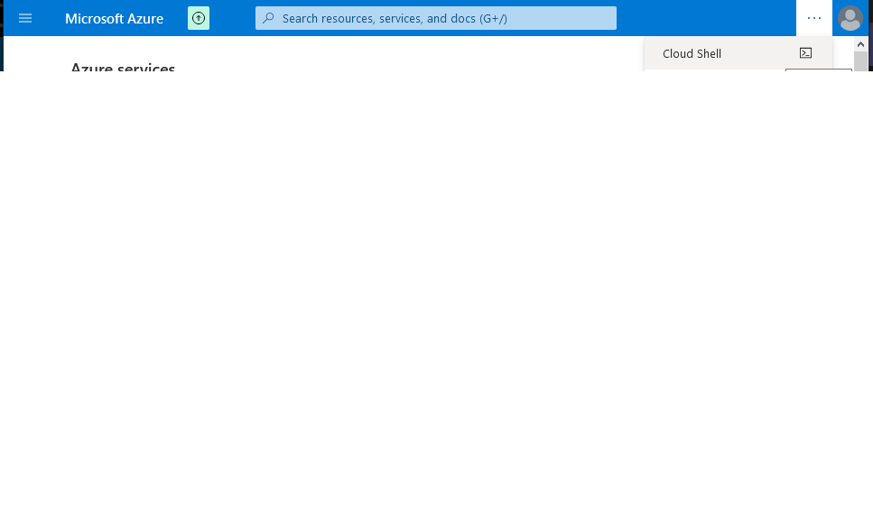
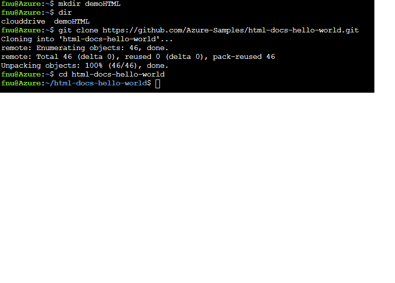
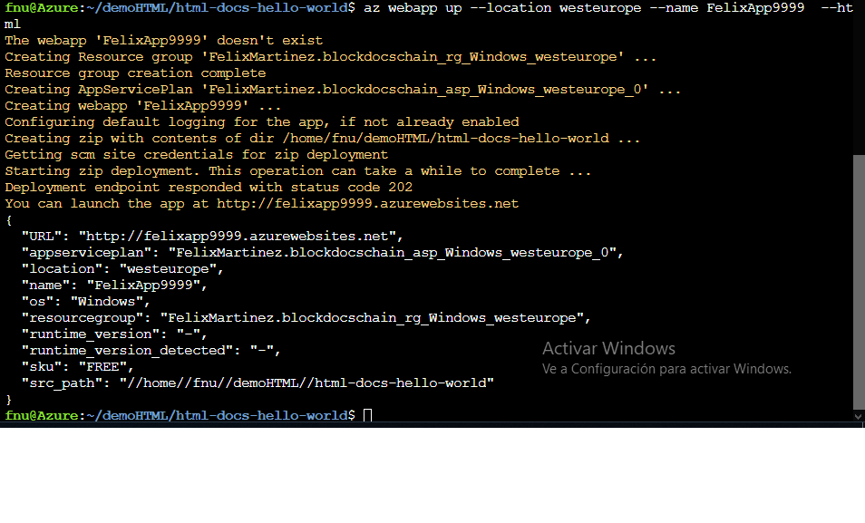
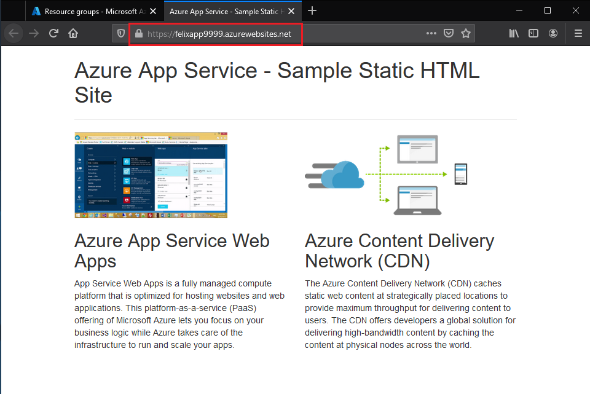
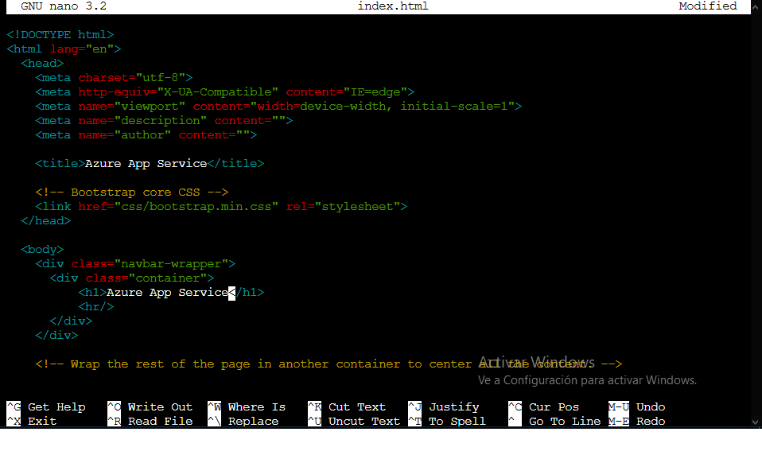
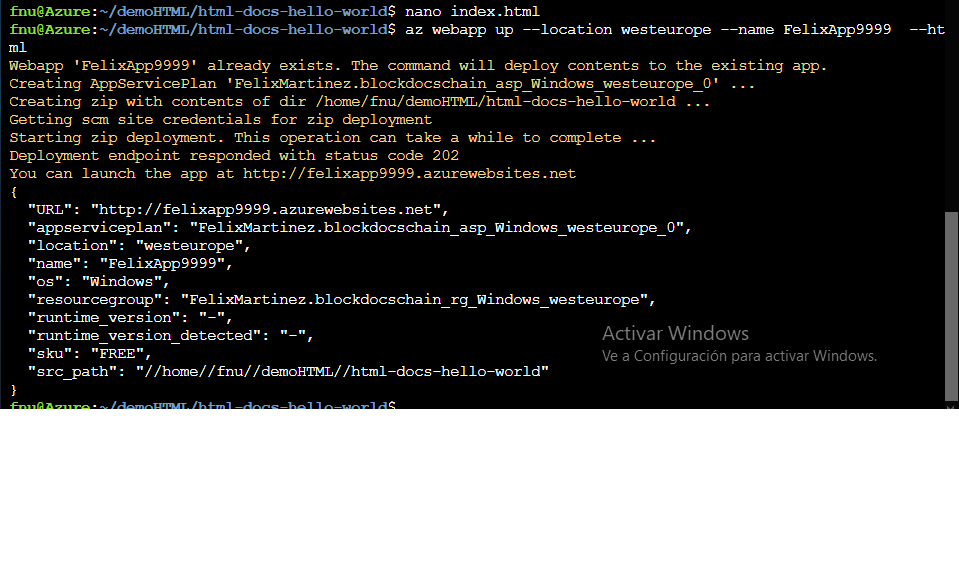
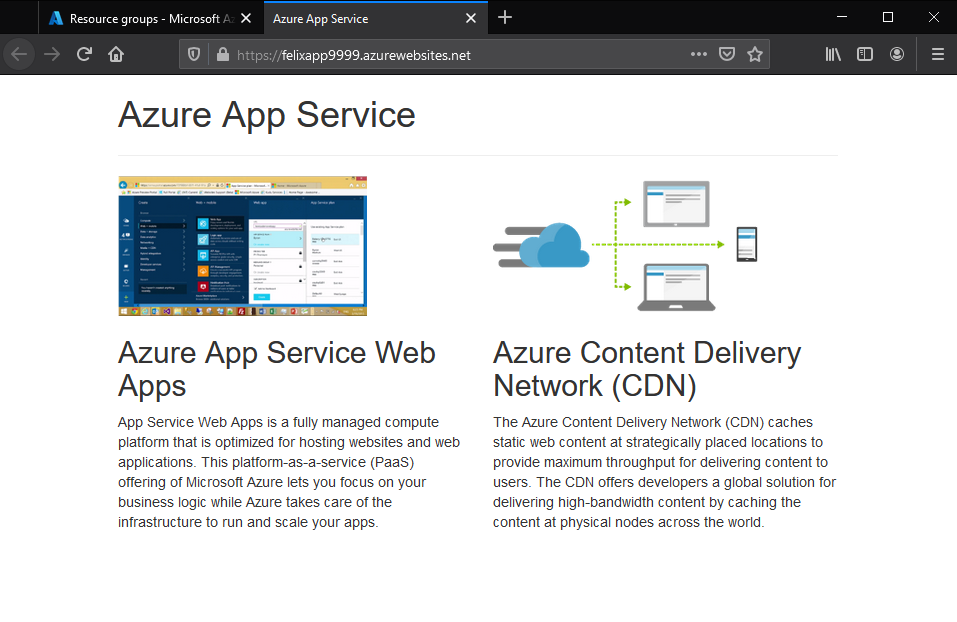
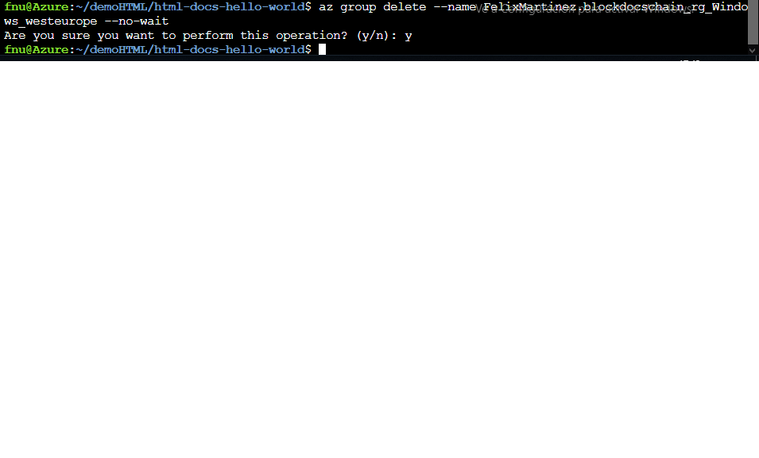

## Demo: Create a static HTML web app by using Azure Cloud Shell

#### Create Demo directory and then change to it && clone the sample from GitHub

#### Create the web app

#### Verify the app is running

#### Update and redeploy the app

#### Redeploy

#### Verify the changes

#### Clean up resources

