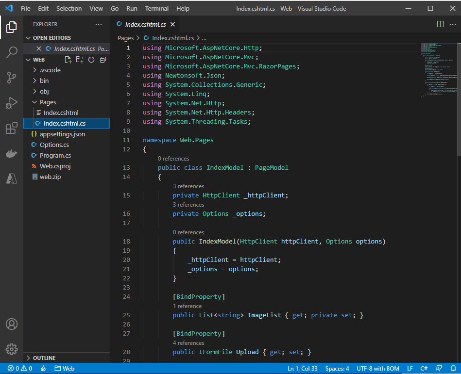

# Lab 01: Building a web application on Azure platform as a service offerings

## Microsoft Azure user interface

Given the dynamic nature of Microsoft cloud tools, you might experience Azure UI changes after the development of this training content. These changes might cause the lab instructions and lab steps to not match up.

Microsoft updates this training course when the community brings needed changes to our attention; however, because cloud updates occur frequently, you might encounter UI changes before this training content updates. **If this occurs, adapt to the changes, and then work through them in the labs as needed.**

## Instructions

### Before you start

#### Sign in to the lab virtual machine

Sign in to your Windows 10 virtual machine (VM) by using the following credentials:

- Username: **Admin**
- Password: **Pa55w.rd**

> **Note**: Instructions to connect to the virtual lab environment will be provided by your instructor.

#### Review the installed applications

Find the taskbar on your Windows 10 desktop. The taskbar contains the icons for the applications that you’ll use in this lab:

- Microsoft Edge
- File Explorer
- Windows PowerShell
- Visual Studio Code

### Exercise 1: Build a back-end API by using Azure Storage and the Web Apps feature of Azure App Service

#### Task 1: Open the Azure portal

1. On the taskbar, select the **Microsoft Edge** icon.

2. In the open browser window, go to the Azure portal ([https://portal.azure.com](https://portal.azure.com/)).

3. At the sign-in page, enter the email address for your Microsoft account, and then select **Next**.

4. Enter the password for your Microsoft account, and then select **Sign in**.

   > **Note**: If this is your first time signing in to the Azure portal, a dialog box will display offering a tour of the portal. Select **Get Started** to skip the tour and begin using the portal.

#### Task 2: Create a Storage account

1. In the Azure portal’s navigation pane, select **All services**.

2. From the **All services** blade, select **Storage Accounts**.

3. From the **Storage accounts** blade, get your list of storage account instances.

4. From the **Storage accounts** blade, select **New**.

5. From the **Create storage account** blade, observe the tabs from the blade, such as **Basics**, **Tags**, and **Review + Create**.

   > **Note**: Each tab represents a step in the workflow to create a new storage account. At any time, you can select **Review + Create** to skip the remaining tabs.

6. Select the **Basics** tab, and in the tab area, perform the following actions:

   1. Leave the **Subscription** text box set to its default value.
   2. In the **Resource group** section, select **Create new**, enter **ManagedPlatform**, and then select **OK**.
   3. In the **Storage account name** text box, enter **imgstor\*[yourname]\***.
   4. In the **Location** list, select the **(US) East US** region.
   5. In the **Performance** section, select **Standard**.
   6. In the **Redundancy** list, select **Locally-redundant storage (LRS)**.
   7. Select **Review + Create**.

7. From the **Review + Create** tab, review the options that you specified in the previous steps.

8. Select **Create** to create the storage account by using your specified configuration.

9. From the **Deployment** blade, wait for the creation task to complete before moving forward with this lab.

10. Select the **Go to resource** button from the **Deployment** blade to go to the newly created storage account.

    

11. From the **Storage account** blade, find the **Security + networking** section, and then select **Access keys**.

12. From the **Access keys** blade, select any one of the keys, and then record the value of either of the **Connection string** boxes. You’ll use this value later in this lab.

    > **Note**: It doesn’t matter which connection string you choose. They are interchangeable.


#### Task 3: Upload a sample blob

1. In the Azure portal’s navigation pane, select **Resource groups**.

2. From the **Resource groups** blade, select the **ManagedPlatform** resource group that you created earlier in this lab.

3. From the **ManagedPlatform** blade, select the **imgstor\*[yourname]\*** storage account that you created earlier in this lab.

4. From the **Storage Account** blade, in the **Data storage** section, select the **Containers** link.

5. In the **Containers** section, select **+ Container**.

   

6. In the **New container** window, perform the following actions:

   1. In the **Name** text box, enter **images**.

   2. In the **Public access level** list, select **Blob (anonymous read access for blobs only)**, and then select **Create**.

      

7. In the **Containers** section, select the newly created **images** container.

   

8. From the **Container** blade, select **Upload**.

9. In the **Upload blob** window, perform the following actions:

   1. In the **Files** section, select the **Folder** icon.

   2. In the **File Explorer** window, browse to **Allfiles (F):\Allfiles\Labs\01\Starter\Images**, select the **grilledcheese.jpg** file, and then select **Open**.

   3. Ensure that the **Overwrite if files already exist** check box is selected, and then select **Upload**. Wait for the blob to upload before you continue with this lab.

      

      

#### Task 4: Create a web app

1. In the Azure portal’s navigation pane, select **Create a resource**.

2. From the **Create a resource** blade, find the **Search services and marketplace** text box.

3. In the search box, enter **Web App**, and then select Enter.

4. From the **Marketplace** search results blade, select the **Web App** result.

5. From the **Web App** blade, select **Create**.

6. From the **Create Web App** blade, find the tabs from the blade, such as **Basics**.

   > **Note**: Each tab represents a step in the workflow to create a new web app. You can select **Review + Create** at any time to skip the remaining tabs.

7. From the **Basics** tab, perform the following actions:

   1. Leave the **Subscription** text box set to its default value.

   2. In the **Resource group** drop-down list, select **ManagedPlatform**.

   3. In the **Name** text box, enter **imgapi\*[yourname]\***.

   4. In the **Publish** section, select **Code**.

   5. In the **Runtime stack** drop-down list, select **.NET Core 3.1 (LTS)**.

   6. In the **Operating System** section, select **Windows**.

   7. In the **Region** drop-down list, select the **East US** region.

   8. In the **Windows Plan (East US)** section, select **Create new**, enter the value **ManagedPlan** in the **Name** text box, and then select **OK**.

   9. Leave the **SKU and size** section set to its default value.

   10. Select **Next: Deployment (Preview)**.

       

8. From the **Deployment (Preview)** tab, perform the following actions:

   1. Select **Next: Monitoring**.

9. From the **Monitoring** tab, perform the following actions:

   1. In the **Enable Application Insights** section, select **No**.

   2. Select **Review + Create**.

      

10. From the **Review + Create** tab, review the options that you selected during the previous steps.

11. Select **Create** to create the web app by using your specified configuration. Wait for the creation task to complete before you move forward with this lab.

#### Task 5: Configure the web app

1. In the Azure portal’s navigation pane, select **Resource groups**.

2. From the **Resource groups** blade, select the **ManagedPlatform** resource group that you created earlier in this lab.

3. From the **ManagedPlatform** blade, select the **imgapi\*[yourname]\*** web app that you created earlier in this lab.

4. From the **App Services** blade, in the **Settings** section, select the **Configuration** link.

   

5. In the **Configuration** section, perform the following actions:

   1. Select the **Application settings** tab, and then select **New application setting**.

   2. In the **Add/Edit application setting** pop-up dialog, in the **Name** text box, enter **StorageConnectionString**.

   3. In the **Value** text box, enter the storage connection string that you copied earlier in this lab.

   4. Leave the **Deployment slot setting** text box set to its default value, and then select **OK** to close the pop-up dialog and return to the **Configuration** section.

      

   5. Select **Save** from the blade to persist your settings.

   Wait for your application settings to persist before you move forward with the lab.

   

6. From the **App Services** blade in the **Settings** section, select the **Properties** link.

7. In the **Properties** section, copy the value of the **URL** hyperlink. You’ll use this value later in the lab.

   

   > **Note**: At this point, the web server at this URL will return a placeholder webpage. You have not deployed any code to the Web App yet. You will deploy code to the Web App later in this lab.

#### Task 6: Deploy an ASP.NET web application to Web Apps

1. On the taskbar, select the **Visual Studio Code** icon.

2. From the **File** menu, select **Open Folder**.

   

3. In the **File Explorer** window, browse to **Allfiles (F):\Allfiles\Labs\01\Starter\API**, and then select **Select Folder**.

4. In the Explorer pane of the **Visual Studio Code** window, expand the **Controllers** folder, and then select the **ImagesController.cs** file to open the file in the editor.

5. In the editor, in the **ImagesController** class on line 26, observe the **GetCloudBlobContainer** method and the code used to retrieve a container.

6. In the **ImagesController** class on line 36, observe the **Get** method and the code used to retrieve all blobs asynchronously from the **images** container.

7. In the **ImagesController** class on line 55, observe the **Post** method and the code used to persist an uploaded image to Storage.

   

8. On the taskbar, select the **Windows Terminal** icon.

9. At the open command prompt, enter the following command, and then select Enter to sign in to the Azure Command-Line Interface (CLI):

   CodeCopy

   ```
   az login
   ```

   

10. In the **Microsoft Edge** browser window, perform the following actions:

    1. Enter the email address for your Microsoft account, and then select **Next**.
    2. Enter the password for your Microsoft account, and then select **Sign in**.

11. Return to the currently open **Command Prompt** window. Wait for the sign-in process to finish.

12. At the command prompt, enter the following command, and then select Enter to list all the apps in your **ManagedPlatform** resource group:

    CodeCopy

    ```
    az webapp list --resource-group ManagedPlatform
    ```

    

13. Enter the following command, and then select Enter to find the apps that have the **imgapi\*** prefix:

    CodeCopy

    ```
    az webapp list --resource-group ManagedPlatform --query "[?starts_with(name, 'imgapi')]"
    ```

14. Enter the following command, and then select Enter to render only the name of the single app that has the **imgapi\*** prefix:

    CodeCopy

    ```
    az webapp list --resource-group ManagedPlatform --query "[?starts_with(name, 'imgapi')].{Name:name}" --output tsv
    ```

15. Enter the following command, and then select Enter to change the current directory to the **Allfiles (F):\Allfiles\Labs\01\Starter\API** directory that contains the lab files:

    CodeCopy

    ```
    cd F:\Allfiles\Labs\01\Starter\API\
    ```

16. Enter the following command, and then select Enter to deploy the **api.zip** file to the web app that you created earlier in this lab:

    CodeCopy

    ```
    az webapp deployment source config-zip --resource-group ManagedPlatform --src api.zip --name <name-of-your-api-app>
    ```

    > **Note**: Replace the *<name-of-your-api-app>* placeholder with the name of the web app that you created earlier in this lab. You recently queried this app’s name in the previous steps.


Wait for the deployment to complete before you move forward with this lab.

1. In the Azure portal’s navigation pane, select the **Resource groups** link.

2. From the **Resource groups** blade, find and select the **ManagedPlatform** resource group that you created earlier in this lab.

3. From the **ManagedPlatform** blade, select the **imgapi\*[yourname]\*** web app that you created earlier in this lab.

4. From the **App Services** blade, select **Browse**.

5. Perform a GET request to the root of the website, and then observe the JavaScript Object Notation (JSON) array that’s returned. This array should contain the URL for your single uploaded image in your Storage account.

   

6. Return to your browser window with the Azure portal.

7. Close the currently running Visual Studio Code and Windows Terminal applications.

#### Review

In this exercise, you created a web app in Azure and then deployed your ASP.NET web application to Web Apps by using the Azure CLI and Apache Kudu zip file deployment utility.

### Exercise 2: Build a front-end web application by using Azure Web Apps

#### Task 1: Create a web app

1. In the Azure portal’s navigation pane, select **Create a resource**.

2. From the **Create a resource** blade, find the **Search services and marketplace** text box.

3. In the search box, enter **Web App**, and then select Enter.

4. From the **Marketplace** search results blade, select the **Web App** result.

5. From the **Web App** blade, select **Create**.

6. From the **Create Web App** blade, find the tabs from the blade, such as **Basics**.

   > **Note**: Each tab represents a step in the workflow to create a new web app. You can select **Review + Create** at any time to skip the remaining tabs.

7. From the **Basics** tab, perform the following actions:

   1. Leave the **Subscription** text box set to its default value.

   2. In the **Resource group** drop-down list, select **ManagedPlatform**.

   3. In the **Name** text box, enter **imgweb\*[yourname]\***.

   4. In the **Publish** section, select **Code**.

   5. In the **Runtime stack** drop-down list, select **.NET Core 3.1 (LTS)**.

   6. In the **Operating System** section, select **Windows**.

   7. In the **Region** drop-down list, select the **East US** region.

   8. In the **Windows Plan (East US)** section, select **ManagedPlan (S1)**.

   9. Select **Next: Deployment (Preview)**.

      

8. From the **Deployment (Preview)** tab, perform the following actions:

   1. Select **Next: Monitoring**.

9. From the **Monitoring** tab, perform the following actions:

   1. In the **Enable Application Insights** section, select **No**.

      

   2. Select **Review + Create**.

10. From the **Review + Create** tab, review the options that you selected during the previous steps.

11. Select **Create** to create the web app by using your specified configuration. Wait for the creation task to complete before you move forward with this lab.

#### Task 2: Configure a web app

1. In the Azure portal’s navigation pane, select **Resource groups**.

2. From the **Resource groups** blade, select the **ManagedPlatform** resource group that you created earlier in this lab.

3. From the **ManagedPlatform** blade, select the **imgweb\*[yourname]\*** web app that you created earlier in this lab.

4. From the **App Services** blade, in the **Settings** section, select the **Configuration** link.

5. In the **Configuration** section, perform the following actions:

   1. Select the **Application settings** tab, and then select **New application setting**.

   2. In the **Add/Edit application setting** pop-up dialog, in the **Name** text box, enter **ApiUrl**.

   3. In the **Value** text box, enter the web app URL that you copied earlier in this lab.

      > **Note**: Make sure you include the protocol, such as **https://**, in the URL that you copy into the **Value** text box for this application setting.

   4. Leave the **Deployment slot setting** text box set to its default value.

   5. Select **OK** to close the pop-up dialog, and then return to the **Configuration** section.

   6. Select **Save** from the blade to persist your settings.

   Wait for your application settings to persist before you move forward with the lab.

   

#### Task 3: Deploy an ASP.NET web application to Web Apps

1. On the taskbar, select the **Visual Studio Code** icon.

2. From the **File** menu, select **Open Folder**.

3. In the **File Explorer** window, browse to **Allfiles (F):\Allfiles\Labs\01\Starter\Web**, and then select **Select Folder**.

4. In the Explorer pane of the **Visual Studio Code** window, expand the **Pages** folder, and then select the **Index.cshtml.cs** file to open the file in the editor.

   

5. In the editor, in the **IndexModel** class on line 30, observe the **OnGetAsync** method and the code used to retrieve the list of images from the API.

6. In the **IndexModel** class on line 41, observe the **OnPostAsync** method and the code used to stream an uploaded image to the back-end API.

   

7. On the taskbar, select the **Windows Terminal** icon.

8. At the open command prompt, enter the following command, and then select Enter to sign in to the Azure CLI:

   CodeCopy

   ```
   az login
   ```

   

9. In the browser window, perform the following actions:

   1. Enter the email address for your Microsoft account, and then select **Next**.
   2. Enter the password for your Microsoft account, and then select **Sign in**.

10. Return to the currently open **Command Prompt** window. Wait for the sign-in process to finish.

11. Enter the following command, and then select Enter to list all the apps in your **ManagedPlatform** resource group:

    CodeCopy

    ```
    az webapp list --resource-group ManagedPlatform
    ```

12. Enter the following command, and then select Enter to find the apps that have the **imgweb\*** prefix:

    CodeCopy

    ```
    az webapp list --resource-group ManagedPlatform --query "[?starts_with(name, 'imgweb')]"
    ```

13. Enter the following command, and then select Enter to render only the name of the single app that has the **imgweb\*** prefix:

    CodeCopy

    ```
    az webapp list --resource-group ManagedPlatform --query "[?starts_with(name, 'imgweb')].{Name:name}" --output tsv
    ```

14. Enter the following command, and then select Enter to change the current directory to the **Allfiles (F):\Allfiles\Labs\01\Starter\Web** directory that contains the lab files:

    CodeCopy

    ```
    cd F:\Allfiles\Labs\01\Starter\Web\
    ```

15. Enter the following command, and then select Enter to deploy the **web.zip** file to the web app that you created earlier in this lab:

    CodeCopy

    ```
    az webapp deployment source config-zip --resource-group ManagedPlatform --src web.zip --name <name-of-your-web-app>
    ```

    > **Note**: Replace the *<name-of-your-web-app>* placeholder with the name of the web app that you created earlier in this lab. You recently queried this app’s name in the previous steps.


Wait for the deployment to complete before you move forward with this lab.

1. In the Azure portal’s navigation pane, select **Resource groups**.

2. From the **Resource groups** blade, select the **ManagedPlatform** resource group that you created earlier in this lab.

3. From the **ManagedPlatform** blade, select the **imgweb\*[yourname]\*** web app that you created earlier in this lab.

4. From the **App Services** blade, select **Browse**.

   

5. Observe the list of images in the gallery. The gallery should list a single image that was uploaded to Storage earlier in the lab.

   

6. From the **Contoso Photo Gallery** webpage, find the **Upload a new image** section, and then perform the following actions:

   1. Select **Browse**.
   2. In the **File Explorer** window, browse to **Allfiles (F):\Allfiles\Labs\01\Starter\Images**, select the **bahnmi.jpg** file, and then select **Open**.
   3. Select **Upload**.

7. Observe that the list of gallery images has updated with your new image.

   > **Note**: In some rare cases, you might need to refresh your browser window to retrieve the new image.

   

8. Return to your browser window with the Azure portal.

9. Close the currently running Visual Studio Code and Windows Terminal applications.

#### Review

In this exercise, you created an Azure web app and deployed an existing web application’s code to the resource in the cloud.

### Exercise 3: Clean up your subscription

#### Task 1: Open Azure Cloud Shell

1. In the Azure portal, select the **Cloud Shell** icon to open a new shell instance.

   > **Note**: The **Cloud Shell** icon is represented by a greater than sign (>) and underscore character (_).

2. If this is your first time opening Cloud Shell using your subscription, you can use the **Welcome to Azure Cloud Shell Wizard** to configure Cloud Shell for first-time usage. Perform the following actions in the wizard:

   1. A dialog box prompts you to configure the shell. Select **Bash**, review the selected subscription, and then select **Create storage**.
   2. Wait for Cloud Shell to finish its initial setup procedures before moving forward with the lab.

   > **Note**: If you don’t notice the Cloud Shell configuration options, this is most likely because you’re using an existing subscription with this course’s labs. The labs are written with the presumption that you’re using a new subscription.


#### Task 2: Delete resource groups

1. Enter the following command, and then select Enter to delete the **ManagedPlatform** resource group:

   CodeCopy

   ```
   az group delete --name ManagedPlatform --no-wait --yes
   ```

   
