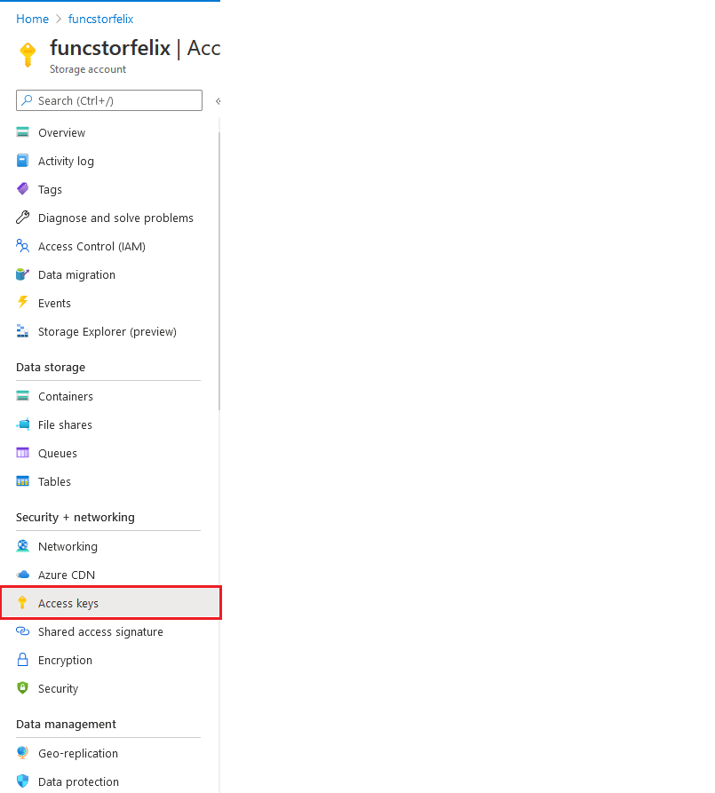
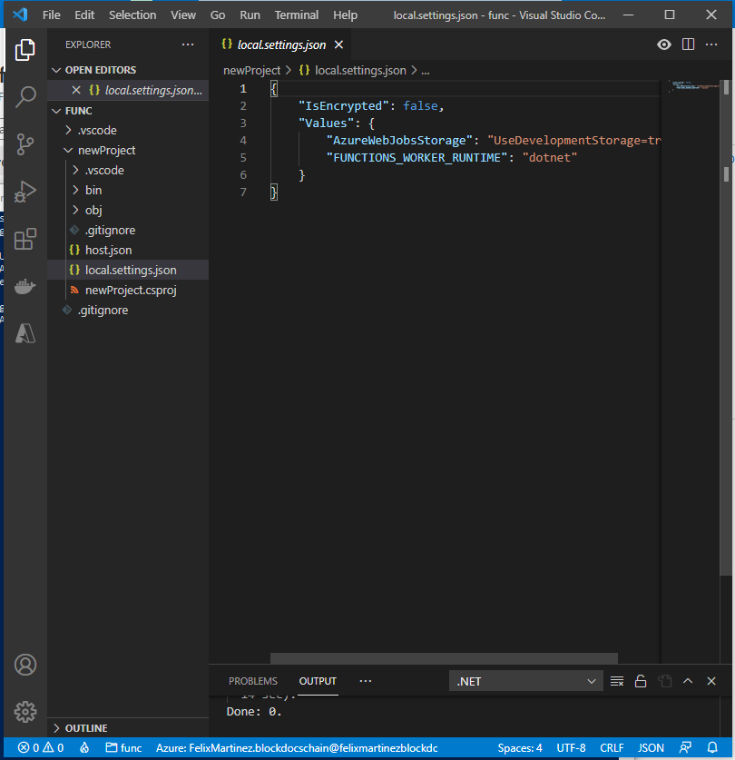
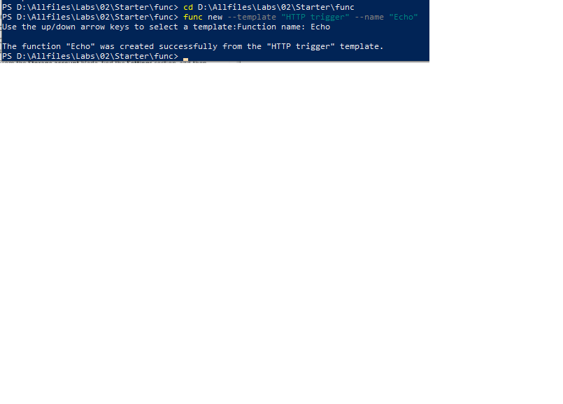
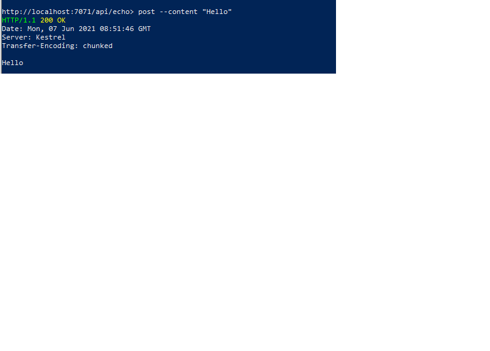
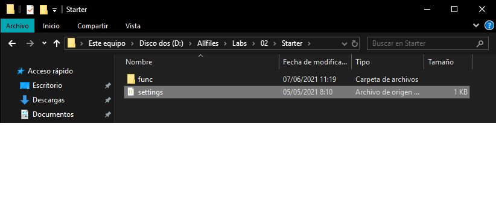
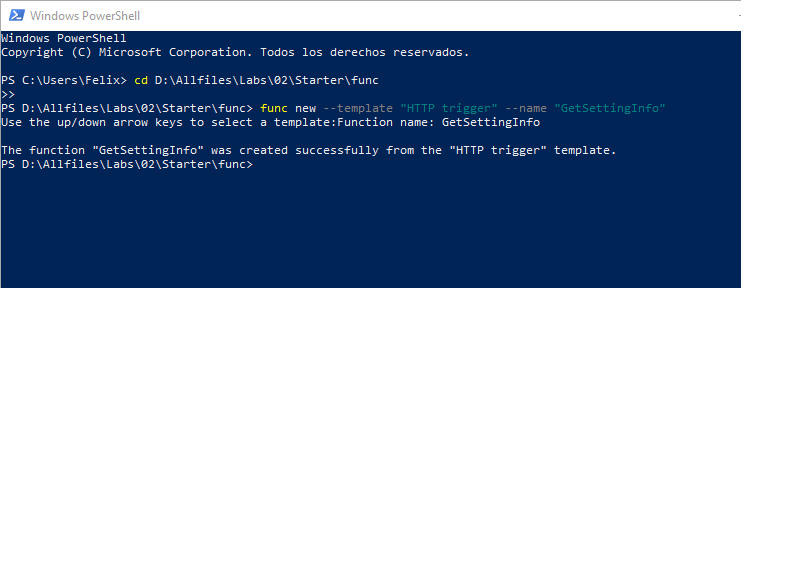
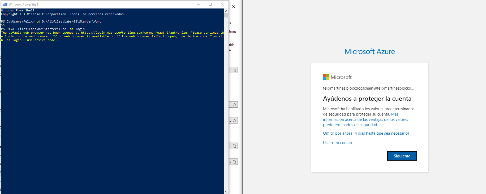

## Lab M02: Implement task processing logic by using Azure Functions

#### Task 2: Create an Azure Storage account

##### Task 3: Create a Function app

#### Exercise 2: Configure a local Azure Functions project
##### Task 1: Initialize a function project

##### Task 2: Configure connection string

##### Task 3: Build and validate a project

#### Exercise 3: Create a function that's triggered by an HTTP request
##### Task 1: Create an HTTP-triggered function

##### Task 2: Write HTTP-triggered function code

##### Task 3: Test the HTTP-triggered function by using httprepl

### Exercise 4: Create a function that triggers on a schedule
##### Task 1: Create a schedule-triggered function

##### Task 2: Observe function code

##### Task 3: Observe function runs

### Exercise 5: Create a function that integrates with other services
##### Task 1: Upload sample content to Azure Blob Storage

##### Task 2: Create a HTTP-triggered function

##### Task 3: Write HTTP-triggered and blob-inputted function code

##### Task 4: Register Azure Storage blob extensions

### Exercise 6: Deploy a local function project to an Azure Functions app

