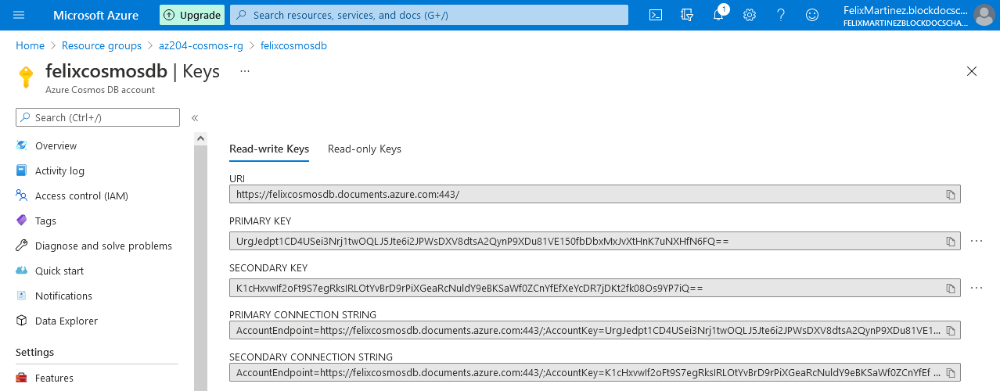
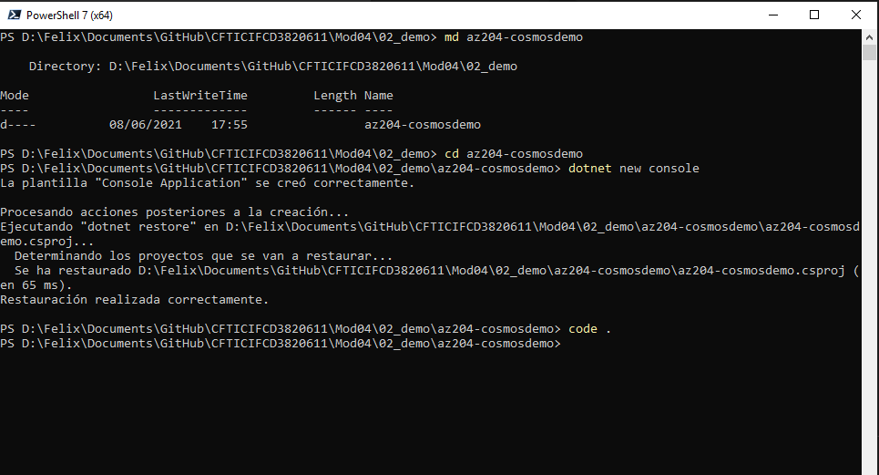
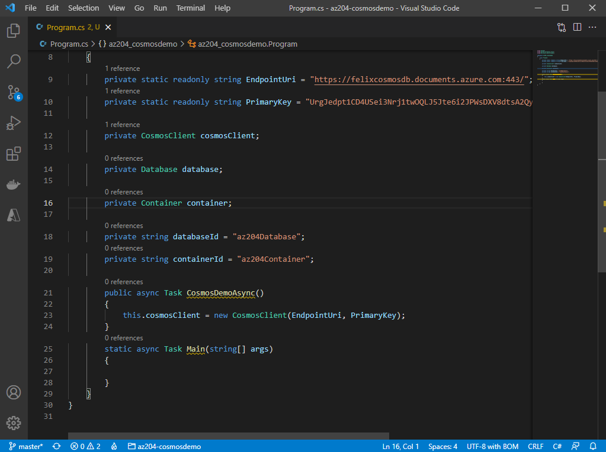
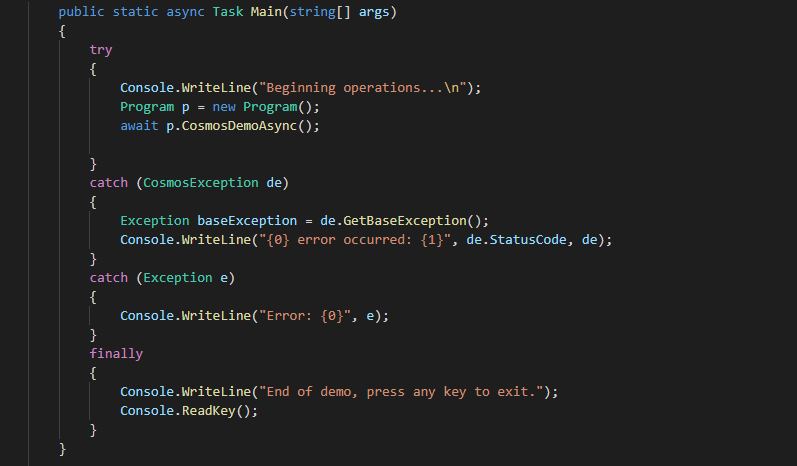
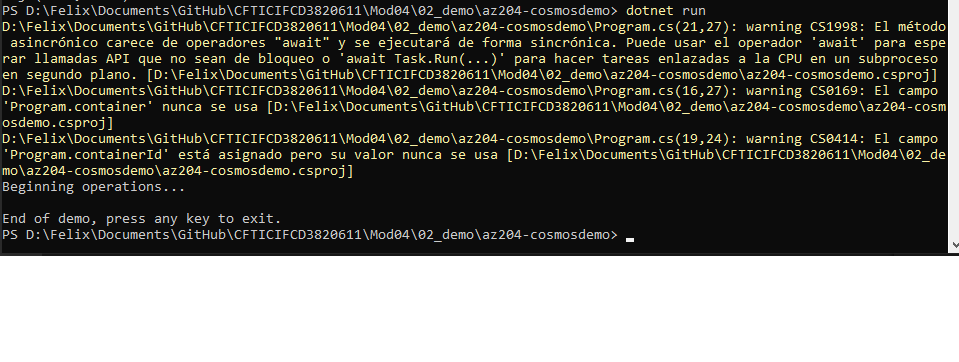
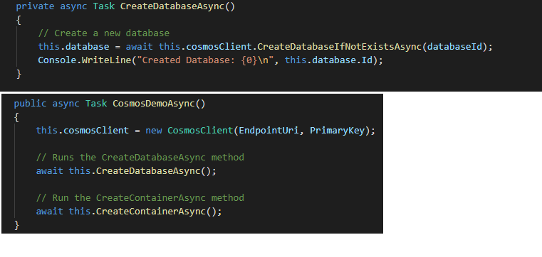
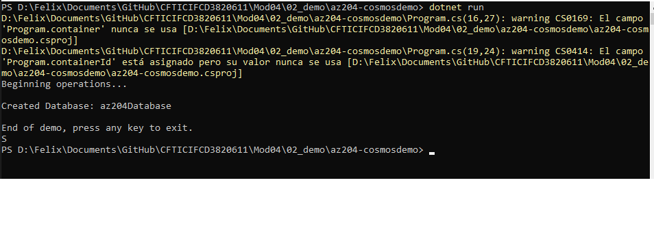
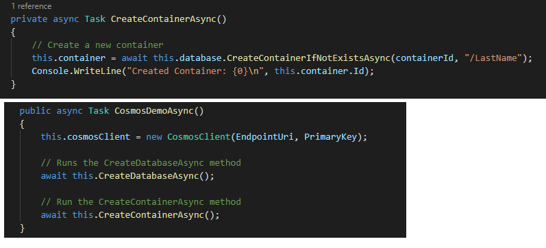
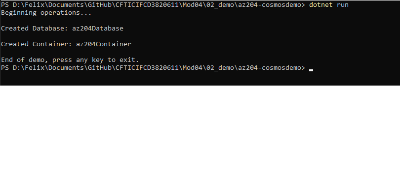

### Demo: Working with Azure Cosmos DB by using .NET

##### Retrieve Azure Cosmos DB account keys

##### Set up the console application

##### Build the console app && Add code to connect to an Azure Cosmos DB account

##### Create a database

##### Create a container

