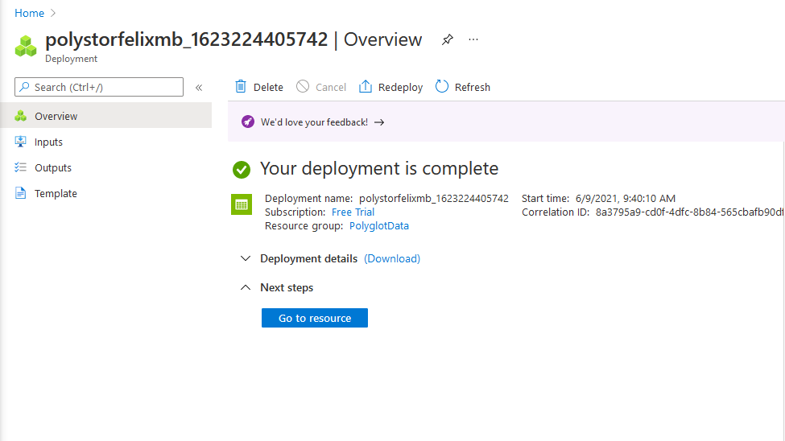
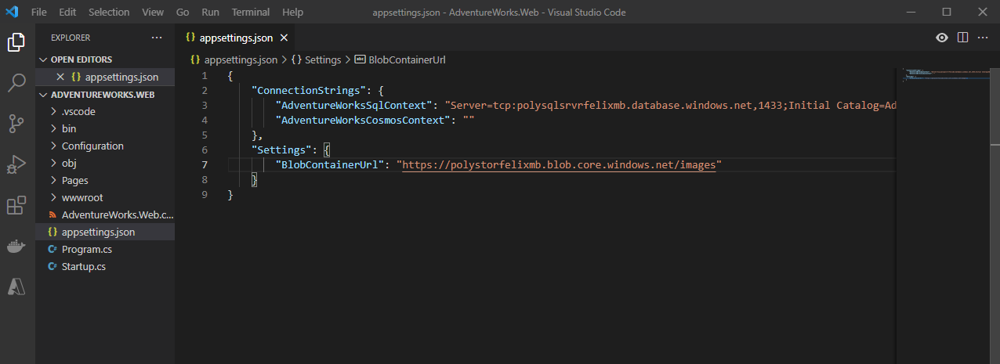

### Lab 04: Constructing a polyglot data solution

#### Exercise 1: Creating database resources in Azure

##### Create an Azure SQL Database server resource

##### Create an Azure Storage account resource

#### Exercise 2: Import and validate data

##### Task 1: Upload image blobs

##### Task 2: Upload an SQL .bacpac file

##### Task 3: Import an SQL database

##### Task 4: Use an imported SQL database

#### Exercise 3: Open and configure a .NET web application

##### Task 1: Open and build the web application

##### Task 2: Update the SQL connection string && Task 3: Update the blob base URL

##### Task 4: Validate the web application

#### Exercise 4: Migrating SQL data to Azure Cosmos DB

##### Task 1: Create a migration project

