### Lab 05: Deploying compute workloads by using images and containers

#### Exercise 1: Create a VM by using the Azure Command-Line Interface (CLI)

##### Task 2: Create a resource group

##### Task 3: Open Azure Cloud Shell
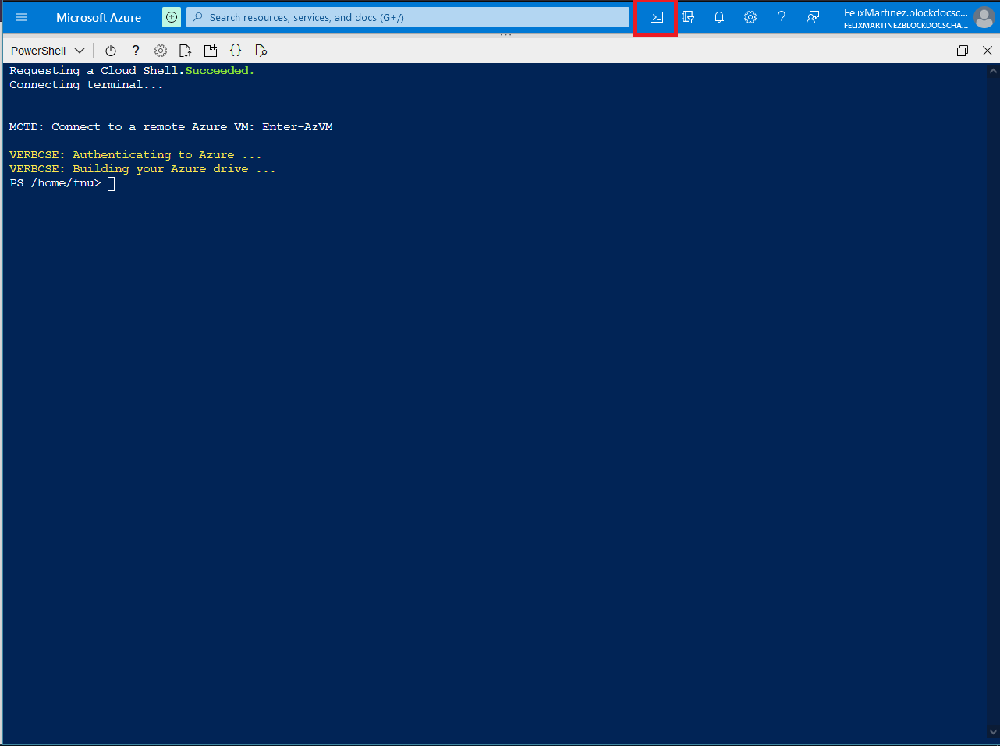

##### Task 4: Use the Azure CLI commands
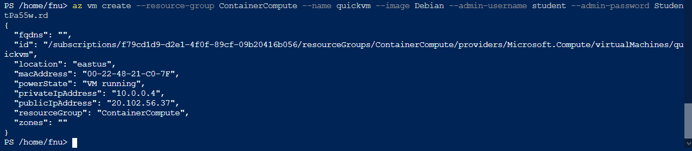
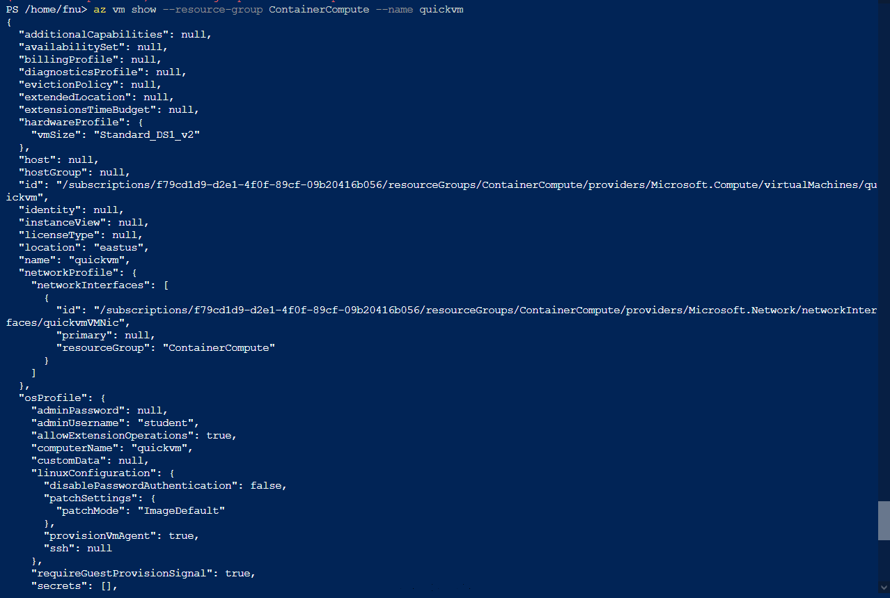
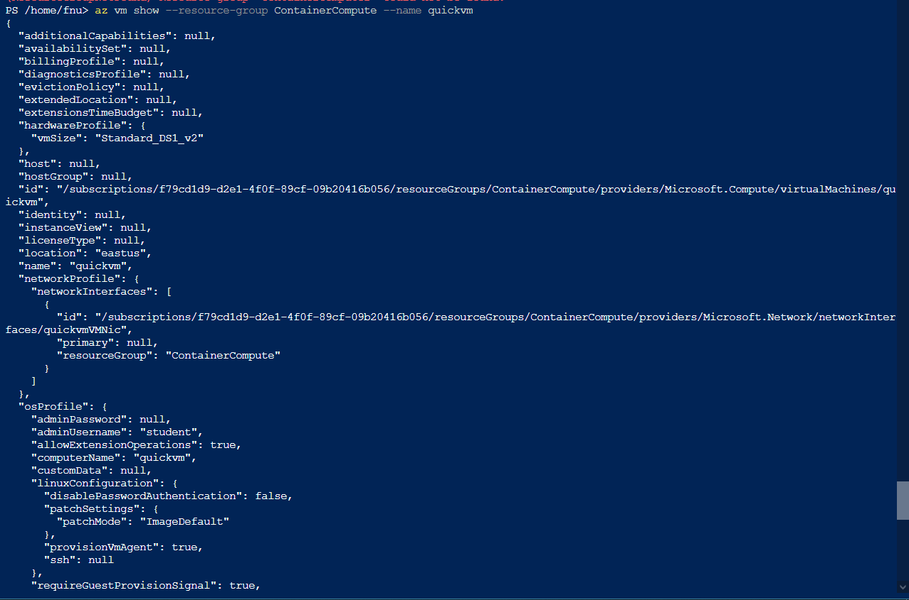
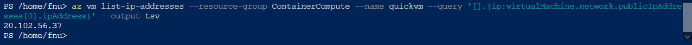
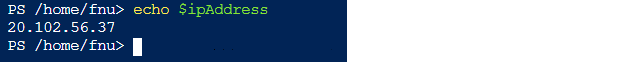

#### Exercise 2: Create a Docker container image and deploy it to Azure Container Registry

##### Task 1: Open the Cloud Shell and editor
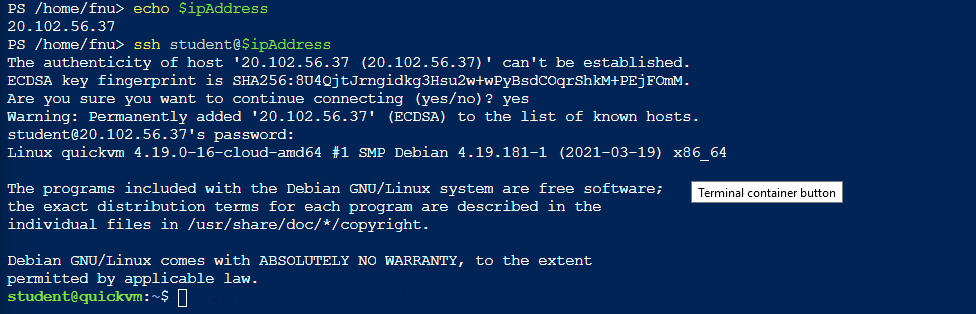
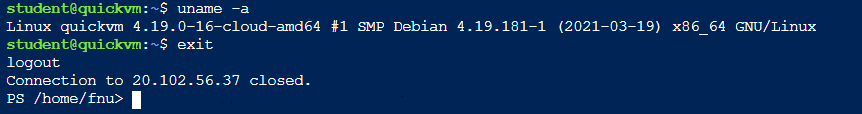
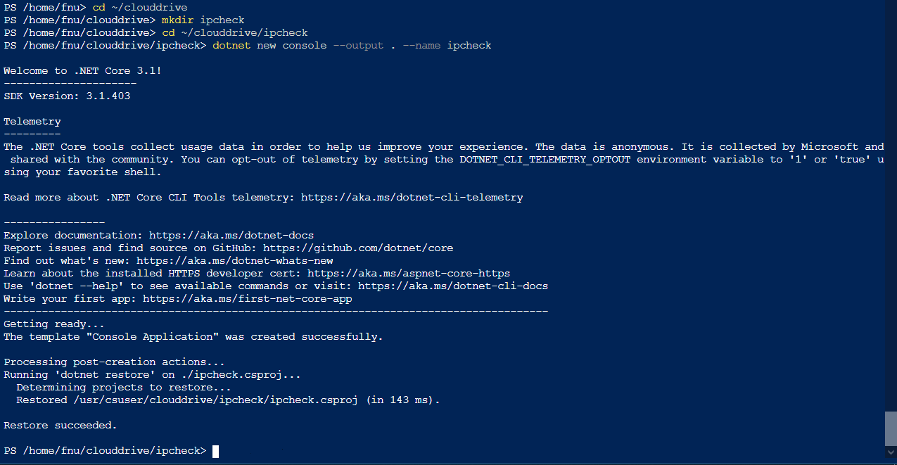

##### Task 2: Create and test a .NET application
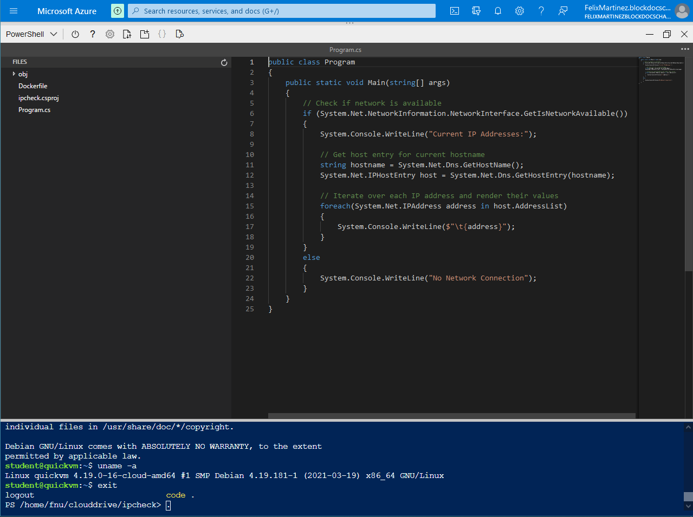
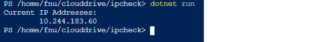
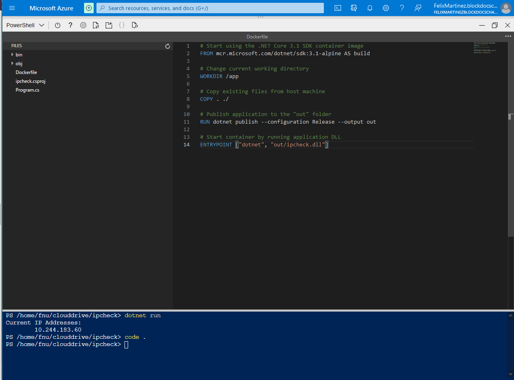

##### Task 3: Create a Container Registry resource
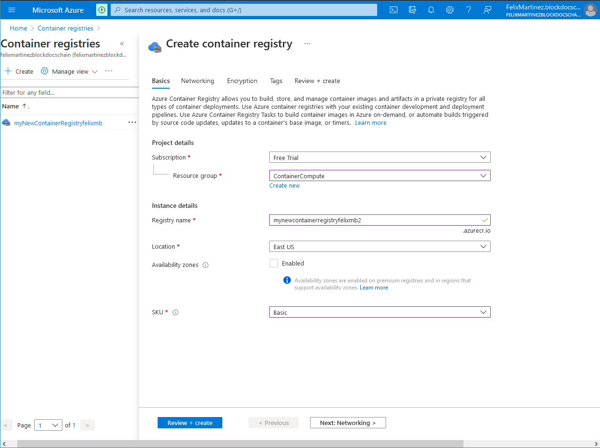

##### Task 4: Open Azure Cloud Shell and store Container Registry metadata
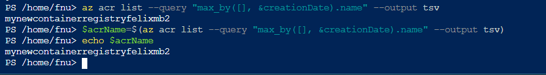

##### Task 5: Deploy a Docker container image to Container Registry
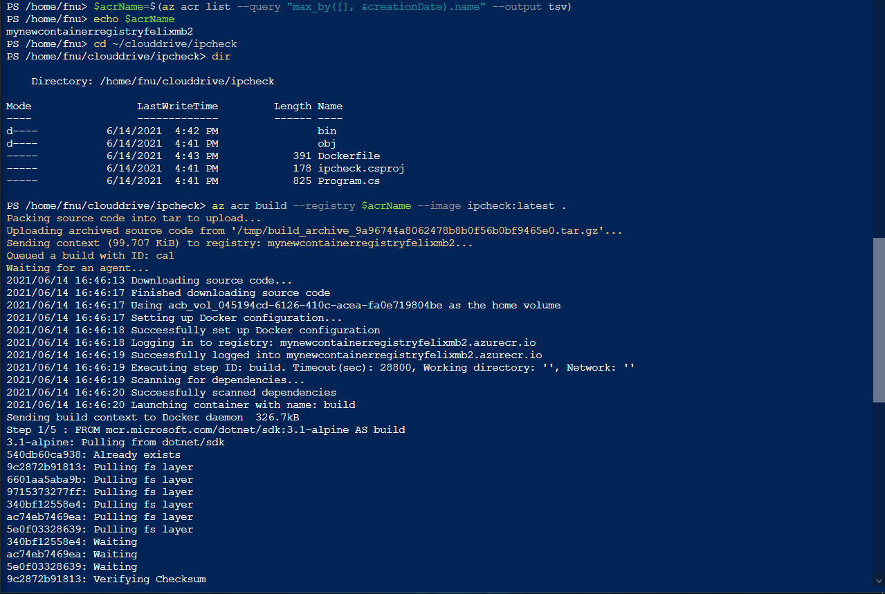

##### Task 6: Validate your container image in Container Registry
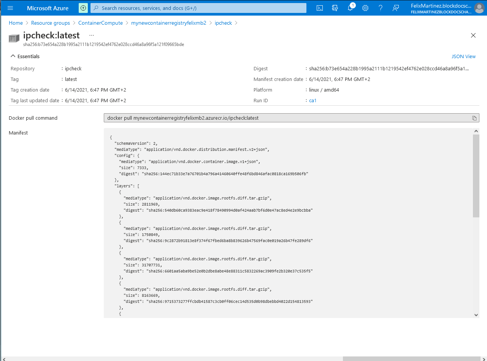

#### Exercise 3: Deploy an Azure container instance

##### Task 1: Enable the admin user in Container Registry
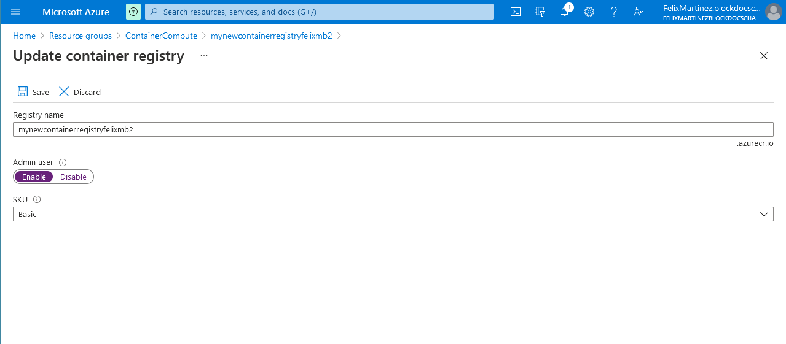
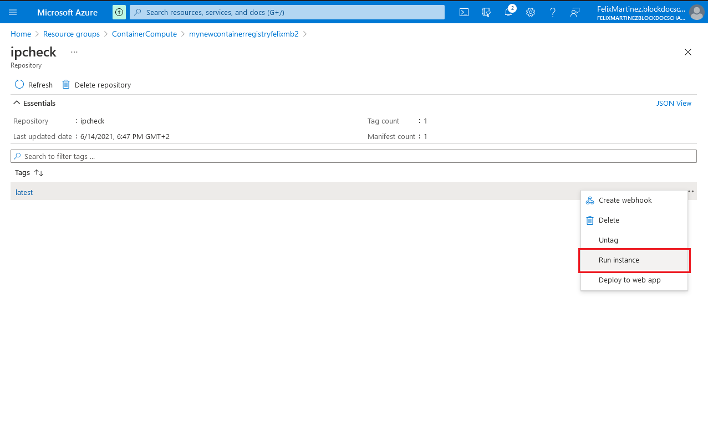

##### Task 2: Automatically deploy a container image to an Azure container instance
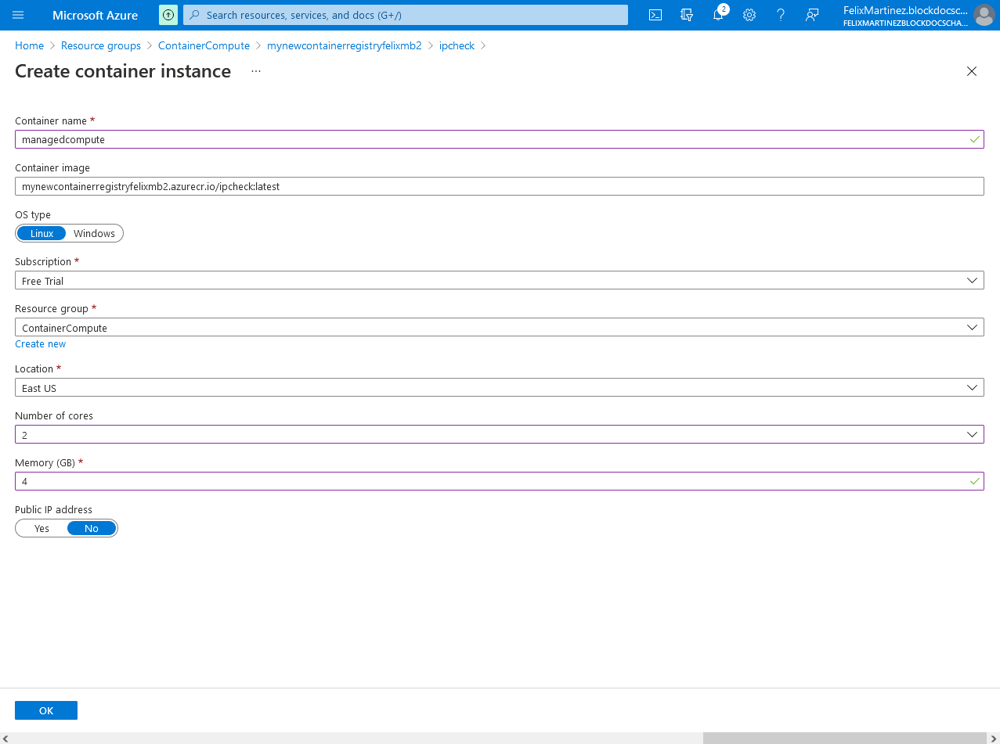

##### Task 3: Manually deploy a container image to Container Instances
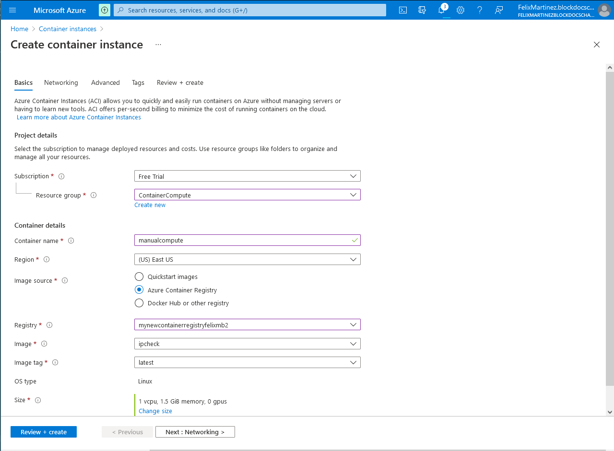

##### Task 4: Validate that the container instance ran successfully
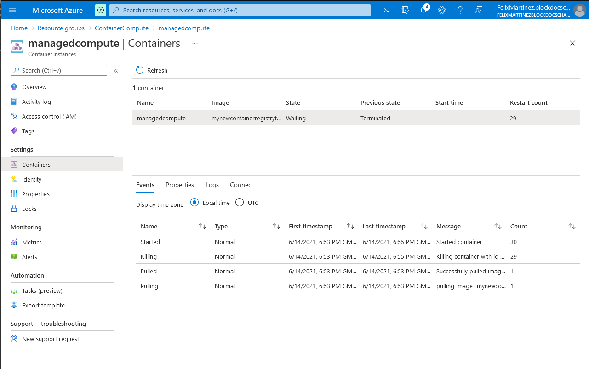
