# Lab 07: Access resource secrets more securely across services

## Microsoft Azure user interface

Given the dynamic nature of Microsoft cloud tools, you might experience Azure user interface (UI) changes after the development of this training content. These changes might cause the lab instructions and lab steps to not match.

Microsoft updates this training course when the community brings needed changes to our attention; however, because cloud updates occur frequently, you might encounter UI changes before this training content updates. **If this occurs, adapt to the changes, and then work through them in the labs as needed.**

## Instructions

### Exercise 1: Create Azure resources

#### Task 1: Open the Azure portal

#### Task 2: Create an Azure Storage account

1. In the Azure portal's navigation pane, select **All services**.

2. From the **All services** blade, select **Storage Accounts**.

3. From the **Storage accounts** blade, find your list of Storage instances.

4. From the **Storage accounts** blade, select **New**.

5. Find the tabs from the 

   Create storage account

    blade, such as

    

   Basics

   .

   > **Note**: Each tab represents a step in the workflow to create a new storage account. You can select **Review + Create** at any time to skip the remaining tabs.

6. From the

    

   Basics

    

   tab, perform the following actions:

   1. Leave the **Subscription** text box set to its default value.
   2. In the **Resource group** section, select **Create new**, enter **ConfidentialStack**, and then select **OK**.
   3. In the **Storage account name** text box, enter **securestor[yourname]**.
   4. In the **Location** drop-down list, select the **(US) East US** region.
   5. In the **Performance** section, select **Standard**.
   6. In the **Redundancy** drop-down list, select **Locally-redundant storage (LRS)**.
   7. Select **Review + Create**.

7. From the **Review + Create** tab, review the options that you selected during the previous steps.

8. Select

    

   Create

    

   to create the storage account by using your specified configuration.

   > **Note**: Wait for the creation task to complete before you move forward with this lab.

   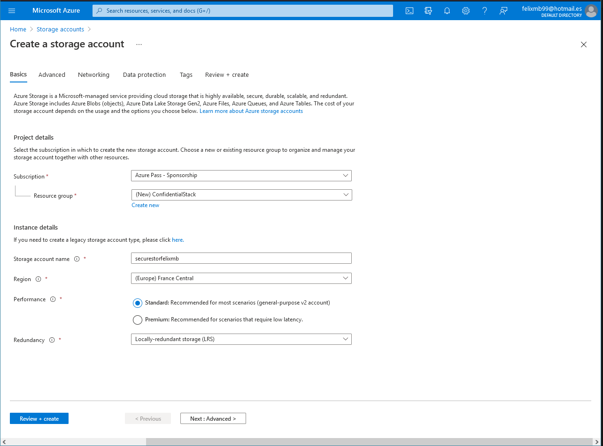

9. In the Azure portal's navigation pane, select **All services**.

10. From the **All services** blade, select **Storage Accounts**.

11. From the **Storage accounts** blade, select the **securestor[yourname]** storage account that you created earlier in this lab.

12. From the **Storage account** blade, find the **Security + networking** section, and then select the **Access keys** link.

13. From the 

    Access keys

     blade, select any one of the keys and record the value in either of the 

    Connection string

     boxes. You'll use this value later in this lab.

    > **Note**: It doesn't matter which connection string you choose. They are interchangeable.

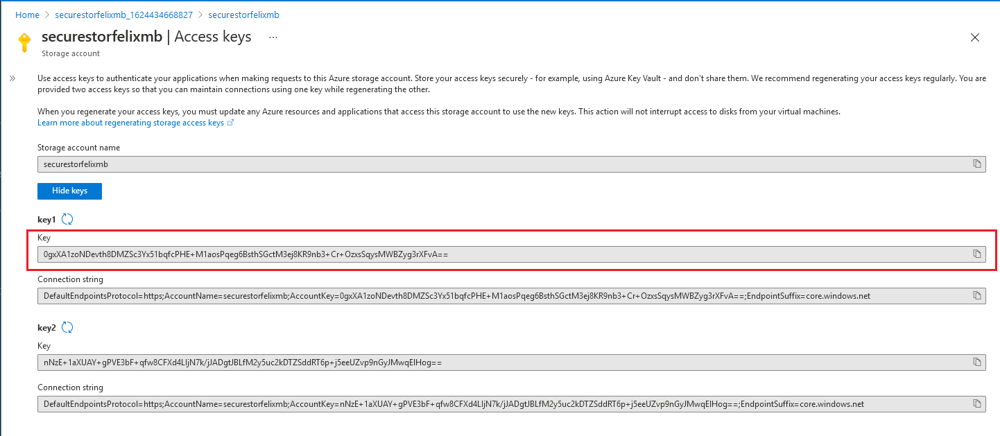

#### Task 3: Create an Azure Key Vault

1. In the Azure portal's navigation pane, select the **Create a resource** link.

2. From the **Create a resource** blade, find the **Search services and marketplace** text box.

3. In the search box, enter **Key Vault**, and then select Enter.

4. From the **Marketplace** search results blade, select the **Key Vault** result.

5. From the **Key Vault** blade, select **Create**.

6. Find the tabs from the 

   Create key vault

    blade, such as

    

   Basics

   .

   > **Note**: Each tab represents a step in the workflow to create a new key vault. You can select **Review + Create** at any time to skip the remaining tabs.

7. From the

    

   Basics

    

   tab, perform the following actions:

   1. Leave the **Subscription** text box set to its default value.
   2. In the **Resource group** section, select **Use existing**, and then select **ConfidentialStack** in the list.
   3. In the **Key vault name** text box, enter **securevault[yourname]**.
   4. In the **Region** drop-down list, select the **East US** region.
   5. In the **Pricing tier** drop-down list, select **Standard**.
   6. Select **Review + Create**.

8. From the **Review + Create** tab, review the options that you selected during the previous steps.

9. Select

    

   Create

    

   to create the key vault by using your specified configuration.

   > **Note**: Wait for the creation task to complete before you move forward with this lab.


#### Task 4: Create an Azure Functions app

1. In the Azure portal's navigation pane, select the **Create a resource** link.

2. From the **Create a resource** blade, find the **Search services and marketplace** text box.

3. In the search box, enter **Function**, and then select Enter.

4. From the **Marketplace** search results blade, select the **Function App** result.

5. From the **Function App** blade, select **Create**.

6. Find the tabs from the 

   Function App

    blade, such as

    

   Basics

   .

   > **Note**: Each tab represents a step in the workflow to create a new function app. You can select **Review + Create** at any time to skip the remaining tabs.

7. From the

    

   Basics

    

   tab, perform the following actions:

   1. Leave the **Subscription** text box set to its default value.
   2. In the **Resource group** section, select **Use existing**, and then select **ConfidentialStack** in the list.
   3. In the **Function app name** text box, enter **securefunc[yourname]**.
   4. In the **Publish** section, select **Code**.
   5. In the **Runtime stack** drop-down list, select **.NET**.
   6. In the **Version** drop-down list, select **3.1**.
   7. In the **Region** drop-down list, select the **East US** region.
   8. Select **Next: Hosting**.

8. From the

    

   Hosting

    

   tab, perform the following actions:

   1. In the **Operating System** section, select **Linux**.
   2. In the **Storage account** drop-down list, select the **securestor[yourname]** storage account that you created earlier in this lab.
   3. In the **Plan type** drop-down list, select the **Consumption (Serverless)** option.
   4. Select **Review + Create**.

9. From the **Review + Create** tab, review the options that you selected during the previous steps.

10. Select

     

    Create

     

    to create the function app by using your specified configuration.

    > **Note**: Wait for the creation task to complete before you move forward with this lab.

> **Review**: In this exercise, you created all the resources that you'll use for this lab.

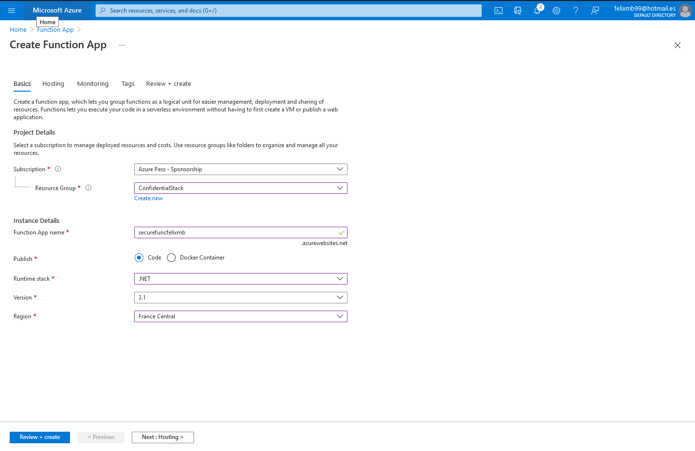

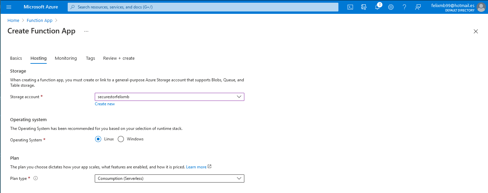

### Exercise 2: Configure secrets and identities

#### Task 1: Configure a system-assigned managed service identity

1. In the Azure portal's navigation pane, select the **Resource groups** link.

2. From the **Resource groups** blade, find and then select the **ConfidentialStack** resource group that you created earlier in this lab.

3. From the

    

   ConfidentialStack

    

   blade, select the

    

   securefunc[yourname]

    

   function app that you created earlier in this lab.

   > **Note**: There will be two resources; a function app and application insights resource, with the same name. Make sure you select the function app resource.

4. From the **Function App** blade, select the **Identity** option from the **Settings** section.

5. From the

    

   Identity

    

   pane, find the

    

   System assigned

    

   tab, and then perform the following actions:

   1. In the **Status** section, select **On**, and then select **Save**.
   2. In the confirmation dialog box, select **Yes**.

   > **Note**: Wait for the system-assigned managed identity to be created before you move forward with this lab.

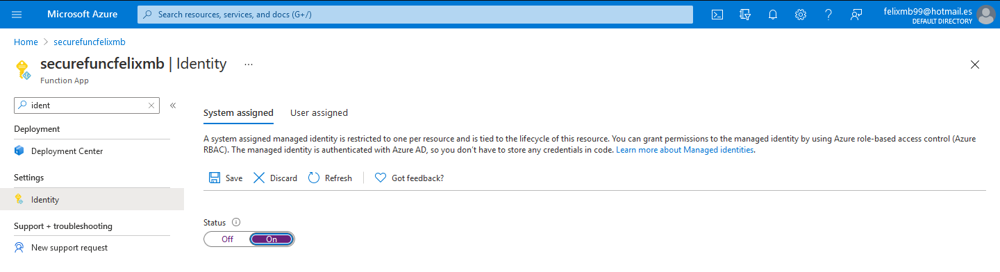

#### Task 2: Create a Key Vault secret

1. In the Azure portal's navigation pane, select the **Resource groups** link.

2. From the **Resource groups** blade, find and then select the **ConfidentialStack** resource group that you created earlier in this lab.

3. From the **ConfidentialStack** blade, select the **securevault[yourname]** key vault that you created earlier in this lab.

4. From the **Key Vault** blade, select the **Secrets** link in the **Settings** section.

5. In the **Secrets** pane, select **Generate/Import**.

6. From the

    

   Create a secret

    

   blade, perform the following actions:

   1. In the **Upload options** drop-down list, select **Manual**.
   2. In the **Name** text box, enter **storagecredentials**.
   3. In the **Value** text box, enter the storage account connection string that you recorded earlier in this lab.
   4. Leave the **Content Type** text box set to its default value.
   5. Leave the **Set activation date** text box set to its default value.
   6. Leave the **Set expiration date** text box set to its default value.
   7. In the **Enabled** section, select **Yes**, and then select **Create**.

   > **Note**: Wait for the secret to be created before you move forward with this lab.

   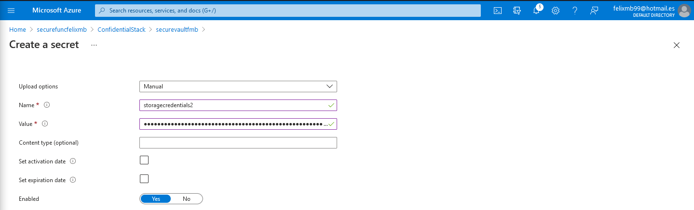

7. Return to the Secrets pane, and then select the **storagecredentials** item in the list.

8. In the Versions pane, select the latest version of the **storagecredentials** secret.

9. In the Secret Version pane, perform the following actions:

   1. Find the metadata for the latest version of the secret.
   2. Select **Show secret value** to find the value of the secret.
   3. Record the value of the **Secret Identifier** text box because you'll use this later in the lab.

   > **Note**: You are recording the value of the **Secret Identifier** text box, not the **Secret Value** text box.

#### Task 3: Configure a Key Vault access policy

1. In the Azure portal's navigation pane, select the **Resource groups** link.

2. From the **Resource groups** blade, find and then select the **ConfidentialStack** resource group that you created earlier in this lab.

3. From the **ConfidentialStack** blade, select the **securevault[yourname]** key vault that you created earlier in this lab.

4. From the **Key Vault** blade, select the **Access policies** link in the **Settings** section.

5. In the Access policies pane, select **Add Access Policy**.

   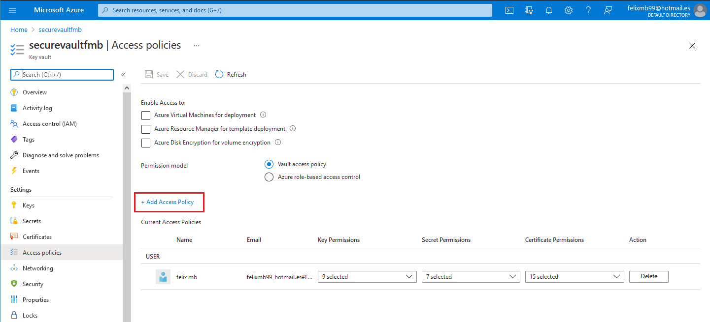

6. From the

    

   Add access policy

    

   blade, perform the following actions:

   1. Select the **Select principal** link.

   2. From the

       

      Principal

       

      blade, find and then select the service principal named

       

      securefunc[yourname]

      , and then select

       

      Select

      .

      > **Note**: The system-assigned managed identity you created earlier in this lab will have the same name as the Azure Function resource.

   3. Leave the **Key permissions** list set to its default value.

   4. In the **Secret permissions** drop-down list, select the **GET** permission.

   5. Leave the **Certificate permissions** list set to its default value.

   6. Leave the **Authorized application** text box set to its default value.

   7. Select **Add**.

7. Back in the Access policies pane, select

    

   Save

   .

   > **Note**: Wait for your changes to the access policies to save before you move forward with this lab.

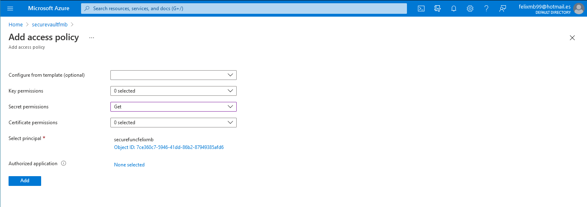

#### Task 4: Create a Key Vault-derived application setting

1. In the Azure portal's navigation pane, select the **Resource groups** link.

2. From the **Resource groups** blade, find and then select the **ConfidentialStack** resource group that you created earlier in this lab.

3. From the **ConfidentialStack** blade, select the **securefunc[yourname]** function app that you created earlier in this lab.

4. From the **App Service** blade, select the **Configuration** option from the **Settings** section.

5. From the

    

   Configuration

    

   pane, perform the following actions:

   1. Select the **Application settings** tab, and then select **New application setting**.

      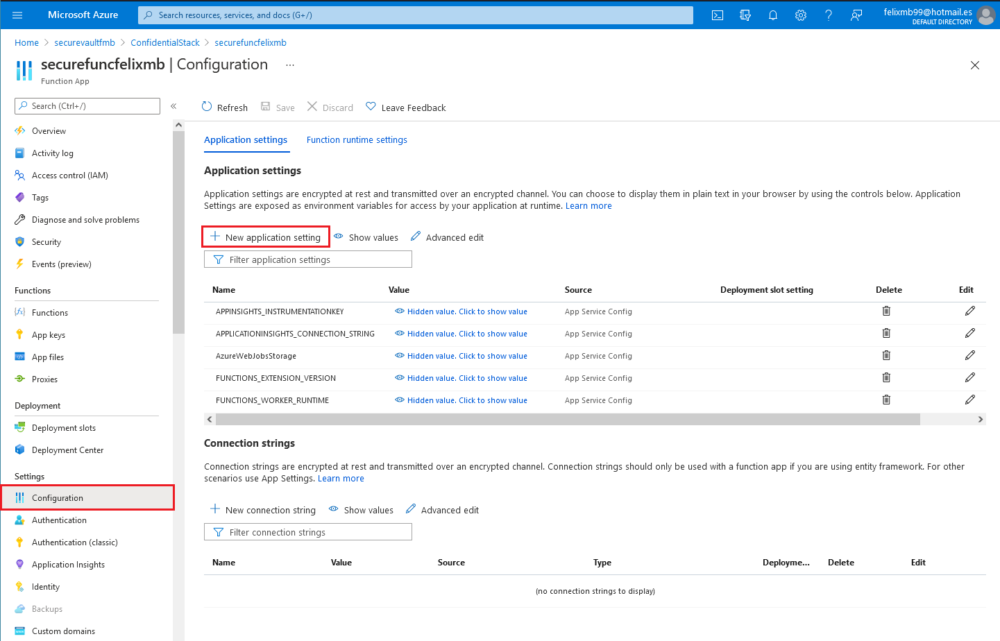

   2. In the **Add/Edit application setting** pop-up window, in the **Name** text box, enter **StorageConnectionString**.

   3. In the

       

      Value

       

      text box, construct a value by using the following syntax:

       

      ```
      @Microsoft.KeyVault(SecretUri=*Secret Identifier*)
      ```

      > **Note**: You'll need to build a reference to your ***Secret Identifier*** by using the above syntax. For example, if your secret identifier is `https://securevaultstudent.vault.azure.net/secrets/storagecredentials/17b41386df3e4191b92f089f5efb4cbf`, your value would be `@Microsoft.KeyVault(SecretUri=https://securevaultstudent.vault.azure.net/secrets/storagecredentials/17b41386df3e4191b92f089f5efb4cbf)`.

   4. Leave the **deployment slot setting** text box set to its default value.

   5. Select **OK** to close the pop-up window and return to the **Configuration** section.

   6. Select **Save** from the blade to save your settings.

   7. In the **Save Changes** confirmation pop-up dialog box, select **Continue**.

      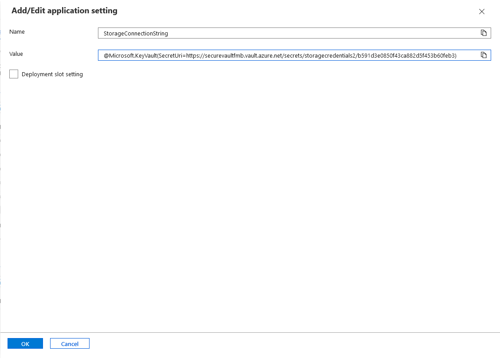

   > **Note**: Wait for your application settings to save before you move forward with the lab.

> **Review**: In this exercise, you created a system-assigned managed service identity for your function app and then gave that identity the appropriate permissions to get the value of a secret in your key vault. Finally, you created a secret that you referenced within your function app's configuration settings.

### Exercise 3: Build an Azure Functions app

#### Task 1: Initialize a function project

1. On the taskbar, select the **Windows Terminal** icon.

2. Enter the following command, and then select Enter to change the current directory to the **Allfiles (F):\Allfiles\Labs\07\Starter\func** empty directory:

   ```
   cd F:\Allfiles\Labs\07\Starter\func
   ```

3. At the open command prompt, enter the following command, and then select Enter to use the **Azure Functions Core Tools** to create a new local Functions project in the current directory using the **dotnet** runtime:

   ```
   func init --worker-runtime dotnet --force
   ```

   > **Note**: You can review the documentation to [create a new project][azure-functions-core-tools-new-project] using the **Azure Functions Core Tools**.

4. Enter the following command, and then select Enter to **build** the .NET Core 3.1 project:

   ```
   dotnet build
   ```

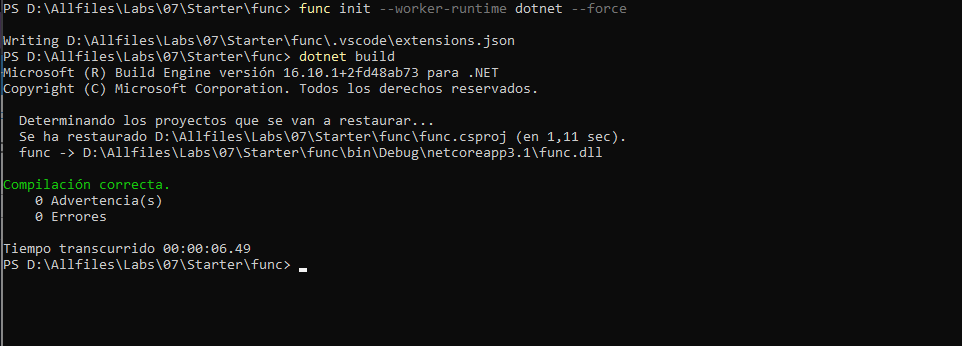

#### Task 2: Create an HTTP-triggered function

1. Still in the open command prompt, enter the following command, and then select Enter to use the **Azure Functions Core Tools** to create a new function named **FileParser** using the **HTTP trigger** template:

   ```
   func new --template "HTTP trigger" --name "FileParser"
   ```

   > **Note**: You can review the documentation to [create a new function][azure-functions-core-tools-new-function] using the **Azure Functions Core Tools**.

2. Close the currently running **Windows Terminal** application.

   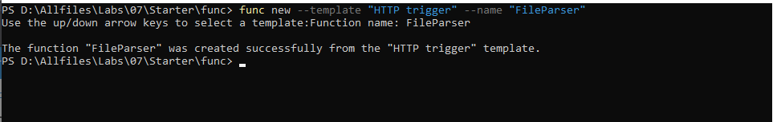

#### Task 3: Configure and read an application setting

1. On the **Start** screen, select the **Visual Studio Code** tile.

2. From the **File** menu, select **Open Folder**.

3. In the **File Explorer** window that opens, browse to **Allfiles (F):\Allfiles\Labs\07\Starter\func**, and then select **Select Folder**.

4. In the Explorer pane of the **Visual Studio Code** window, open the **local.settings.json** file.

5. Observe the current value of the **Values** object:

   ```
   "Values": {
       "AzureWebJobsStorage": "UseDevelopmentStorage=true",
       "FUNCTIONS_WORKER_RUNTIME": "dotnet"
   }
   ```

6. Update the value of the **Values** object by adding a new setting named **StorageConnectionString** and setting it to a string value of **[TEST VALUE]**:

   ```
   "Values": {
       "AzureWebJobsStorage": "UseDevelopmentStorage=true",
       "FUNCTIONS_WORKER_RUNTIME": "dotnet",
       "StorageConnectionString": "[TEST VALUE]"
   }
   ```

7. The **local.settings.json** file should now include:

   ```
   {
       "IsEncrypted": false,
       "Values": {
           "AzureWebJobsStorage": "UseDevelopmentStorage=true",
           "FUNCTIONS_WORKER_RUNTIME": "dotnet",
           "StorageConnectionString": "[TEST VALUE]"
       }
   }
   ```

   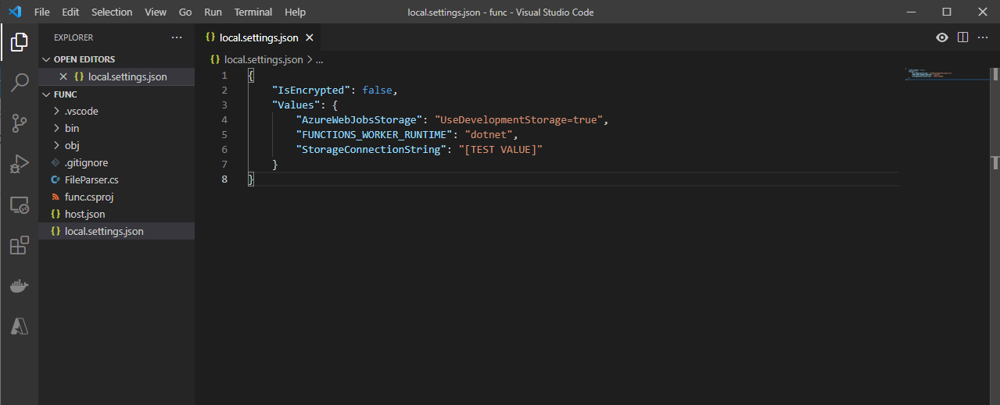

8. In the Explorer pane of the **Visual Studio Code** window, open the **FileParser.cs** file.

9. In the code editor, observe the example implementation:

   ```
   using System;
   using System.IO;
   using System.Threading.Tasks;
   using Microsoft.AspNetCore.Mvc;
   using Microsoft.Azure.WebJobs;
   using Microsoft.Azure.WebJobs.Extensions.Http;
   using Microsoft.AspNetCore.Http;
   using Microsoft.Extensions.Logging;
   using Newtonsoft.Json;
   
   namespace func
   {
       public static class FileParser
       {
           [FunctionName("FileParser")]
           public static async Task<IActionResult> Run(
               [HttpTrigger(AuthorizationLevel.Function, "get", "post", Route = null)] HttpRequest req,
               ILogger log)
           {
               log.LogInformation("C# HTTP trigger function processed a request.");
   
               string name = req.Query["name"];
   
               string requestBody = await new StreamReader(req.Body).ReadToEndAsync();
               dynamic data = JsonConvert.DeserializeObject(requestBody);
               name = name ?? data?.name;
   
               string responseMessage = string.IsNullOrEmpty(name)
                   ? "This HTTP triggered function executed successfully. Pass a name in the query string or in the request body for a personalized response."
                   : $"Hello, {name}. This HTTP triggered function executed successfully.";
   
               return new OkObjectResult(responseMessage);
           }
       }
   }
   ```

10. Delete all of the content within the **FileParser.cs** file.

11. Add the following lines of code to add **using directives** for the **Microsoft.AspNetCore.Mvc**, **Microsoft.Azure.WebJobs**, **Microsoft.AspNetCore.Http**, **System**, and **System.Threading.Tasks** namespaces:

    ```
    using Microsoft.AspNetCore.Mvc;
    using Microsoft.Azure.WebJobs;
    using Microsoft.AspNetCore.Http;
    using System;
    using System.Threading.Tasks;
    ```

12. Create a new **public static** class named **FileParser**:

    ```
    public static class FileParser
    { }
    ```

13. Observe the **FileParser.cs** file again, which should now include:

    ```
    using Microsoft.AspNetCore.Mvc;
    using Microsoft.Azure.WebJobs;
    using Microsoft.AspNetCore.Http;
    using System;
    using System.Threading.Tasks;
    
    public static class FileParser
    { }
    ```

14. Within the **FileParser** class, add the following code block to create a new **public static** *asynchronous* method named **Run** that returns a variable of type **Task<IActionResult>** and that also takes in a variable of type **HttpRequest** named *request*:

    ```
    public static async Task<IActionResult> Run(
        HttpRequest request)
    { }
    ```

15. Add the following code to append an attribute to the **Run** method of type **FunctionNameAttribute** that has its **name** parameter set to a value of **FileParser**:

    ```
    [FunctionName("FileParser")]
    public static async Task<IActionResult> Run(
        HttpRequest request)
    { }
    ```

16. Add the following code to append an attribute to the **request** paramter of type **HttpTriggerAttribute** that has its **methods** parameter array set to a single value of **GET**:

    ```
    [FunctionName("FileParser")]
    public static async Task<IActionResult> Run(
        [HttpTrigger("GET")] HttpRequest request)
    { }
    ```

17. Observe the **FileParser.cs** file again, which should now include:

    ```
    using Microsoft.AspNetCore.Mvc;
    using Microsoft.Azure.WebJobs;
    using Microsoft.AspNetCore.Http;
    using System;
    using System.Threading.Tasks;
    
    public static class FileParser
    {
        [FunctionName("FileParser")]
        public static async Task<IActionResult> Run(
            [HttpTrigger("GET")] HttpRequest request)
        { }
    }
    ```

18. In the **Run** method, enter the following line of code to retrieve the value of the **StorageConnectionString** application setting by using the **Environment.GetEnvironmentVariable** method and storing the result in a **string** variable named **connectionString**:

    ```
    string connectionString = Environment.GetEnvironmentVariable("StorageConnectionString");
    ```

19. Enter the following line of code to return the value of the **connectionString** variable as the HTTP response:

    ```
    return new OkObjectResult(connectionString);
    ```

20. Observe the **FileParser.cs** file again, which should now include:

    ```
    using Microsoft.AspNetCore.Mvc;
    using Microsoft.Azure.WebJobs;
    using Microsoft.AspNetCore.Http;
    using System;
    using System.Threading.Tasks;
    
    public static class FileParser
    {
        [FunctionName("FileParser")]
        public static async Task<IActionResult> Run(
            [HttpTrigger("GET")] HttpRequest request)
        {
            string connectionString = Environment.GetEnvironmentVariable("StorageConnectionString");
            return new OkObjectResult(connectionString);
        }
    }
    ```

21. Select **Save** to save your changes to the **FileParser.cs** file.

    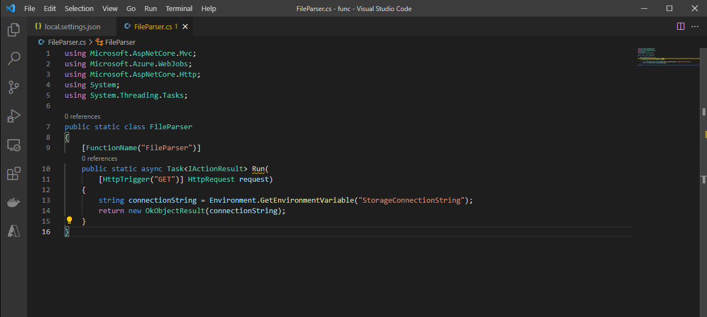

#### Task 4: Validate the local function

1. On the taskbar, select the **Windows Terminal** icon.

2. Enter the following command, and then select Enter to change the current directory to the **Allfiles (F):\Allfiles\Labs\07\Starter\func** empty directory:

   ```
   cd F:\Allfiles\Labs\07\Starter\func
   ```

3. At the open command prompt, enter the following command, and then select Enter to run the function app project:

   ```
   func start --build
   ```

   > **Note**: You can review the documentation to [start the function app project locally][azure-functions-core-tools-start-function] using the **Azure Functions Core Tools**.

   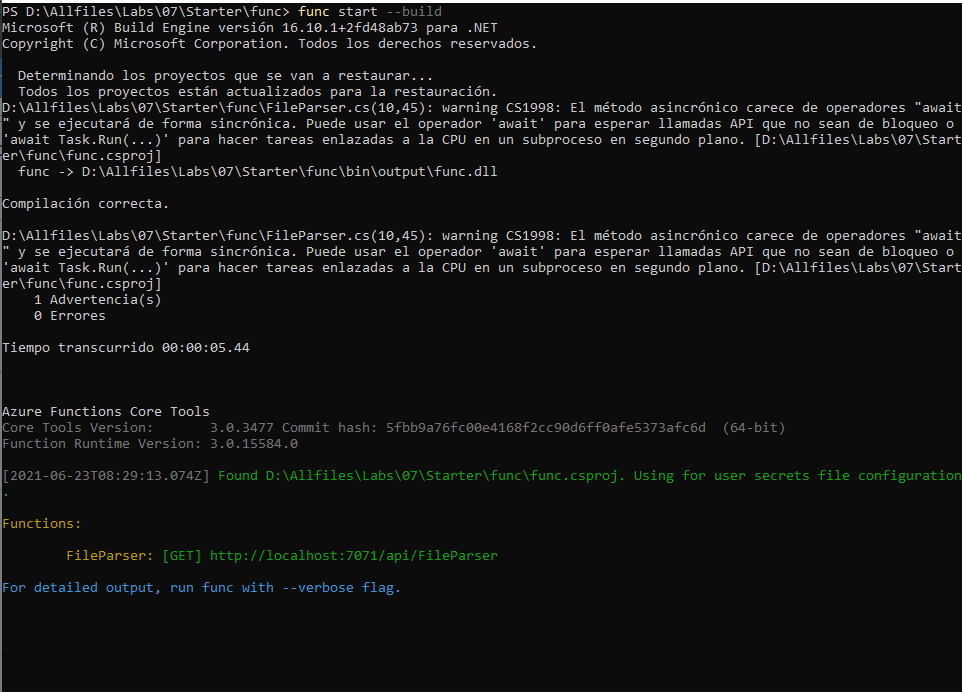

4. On the taskbar, select the **Windows Terminal** icon again to open a new instance of the **Windows Terminal** application.

5. When you receive the open command prompt, enter the following command, and then select Enter to start the **httprepl** tool setting the base Uniform Resource Identifier (URI) to `http://localhost:7071`:

   ```
   httprepl http://localhost:7071
   ```

   > **Note**: An error message is displayed by the httprepl tool. This message occurs because the tool is searching for a Swagger definition file to use to "traverse" the API. Because your functio projectp does not produce a Swagger definition file, you'll need to traverse the API manually.

6. When you receive the tool prompt, enter the following command, and then select Enter to browse to the relative **api** directory:

   ```
   cd api
   ```

7. Enter the following command, and then select Enter to browse to the relative **fileparser** directory:

   ```
   cd fileparser
   ```

8. Enter the following command, and then select Enter to run the **get** command:

   ```
   get
   ```

9. Observe the **[TEST VALUE]** value of the **StorageConnectionString** being returned as the result of the HTTP request:

   ```
   HTTP/1.1 200 OK
   Content-Type: text/plain; charset=utf-8
   Date: Tue, 01 Sep 2020 23:35:39 GMT
   Server: Kestrel
   Transfer-Encoding: chunked
   
   [TEST VALUE]
   ```

10. Enter the following command, and then select Enter to exit the **httprepl** application:

    ```
    exit
    ```

11. Close all currently running instances of the **Windows Terminal** application.

    

#### Task 5: Deploy using the Azure Functions Core Tools

1. On the taskbar, select the **Windows Terminal** icon.

2. Enter the following command, and then select Enter to change the current directory to the **Allfiles (F):\Allfiles\Labs\07\Starter\func** empty directory:

   ```
   cd F:\Allfiles\Labs\07\Starter\func
   ```

3. At the open command prompt, enter the following command, and then select Enter to log in to the Azure Command-Line Interface (CLI):

   ```
   az login
   ```

4. In the **Microsoft Edge** browser window, perform the following actions:

   1. Enter the email address for your Microsoft account, and then select **Next**.
   2. Enter the password for your Microsoft account, and then select **Sign in**.

5. Return to the currently open **Windows Terminal** window. Wait for the sign-in process to finish.

6. Enter the following command, and then select Enter to publish the function app project:

   ```
   func azure functionapp publish <function-app-name>
   ```

   > **Note**: As an example, if your **Function App name** is **securefuncstudent**, your command would be `func azure functionapp publish securefuncstudent`. You can review the documentation to [publish the local function app project][azure-functions-core-tools-publish-azure] using the **Azure Functions Core Tools**.

7. Wait for the deployment to finalize before you move forward with the lab.

8. Close the currently running **Windows Terminal** application.

   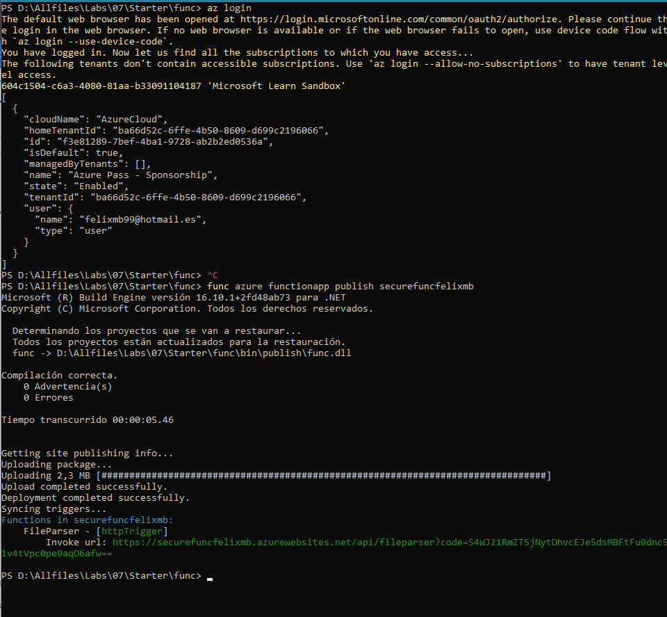

#### Task 6: Test the Key Vault-derived application setting

1. On the taskbar, select the **Microsoft Edge** icon.
2. In the open browser window, go to the Azure portal ([https://portal.azure.com](https://portal.azure.com/)).
3. In the Azure portal's navigation pane, select the **Resource groups** link.
4. On the **Resource groups** blade, find and then select the **ConfidentialStack** resource group that you created earlier in this lab.
5. On the **ConfidentialStack** blade, select the **securefunc[yourname]** function app that you created earlier in this lab.
6. From the **App Service** blade, select the **Functions** option from the **Functions** section.
7. In the **Functions** pane, select the the existing **FileParser** function.
8. In the **Function** blade, select the **Code + Test** option from the **Developer** section.
9. In the function editor, select **Test/Run**.
10. In the pop-up dialog box that appears, perform the following actions:
    - In the **HTTP method** list, select **GET**.
11. Select **Run** to test the function.
12. Observe the results of the test run. The result should be your Azure Storage connection string.

> **Review**: In this exercise, you used a service identity to read the value of a secret stored in Key Vault and returned that value as the result of a function app.

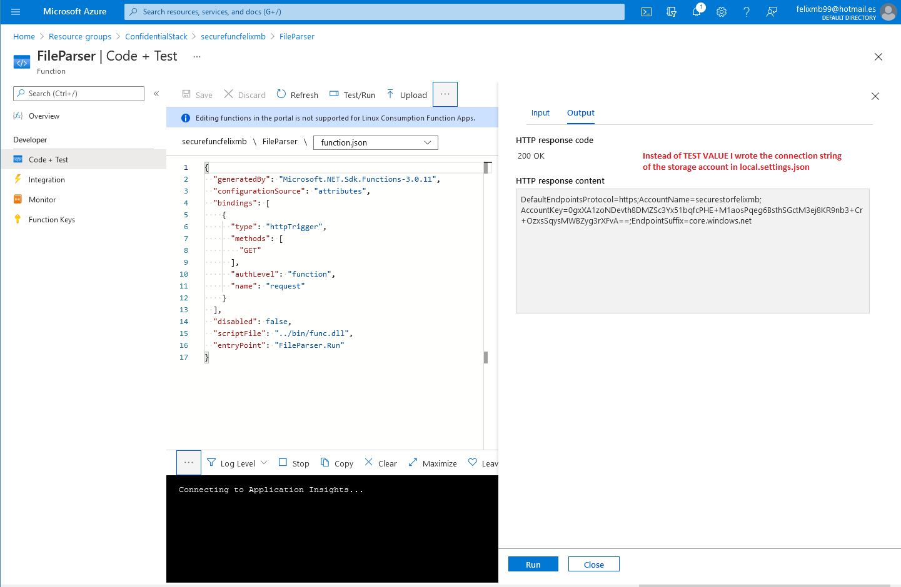

### Exercise 4: Access Azure Blob Storage data

#### Task 1: Upload a sample storage blob

1. In the Azure portal's navigation pane, select the **Resource groups** link.

2. From the **Resource groups** blade, find and then select the **ConfidentialStack** resource group that you created earlier in this lab.

3. From the **ConfidentialStack** blade, select the **securestor[yourname]** storage account that you created earlier in this lab.

4. From the **Storage account** blade, select the **Containers** link in the **Data storage** section.

5. In the **Containers** section, select **+ Container**.

6. In the

    

   New container

    

   pop-up window, perform the following actions:

   1. In the **Name** text box, enter **drop**.

   2. In the **Public access level** drop-down list, select **Blob (anonymous read access for blobs only)**, and then select **Create**.

      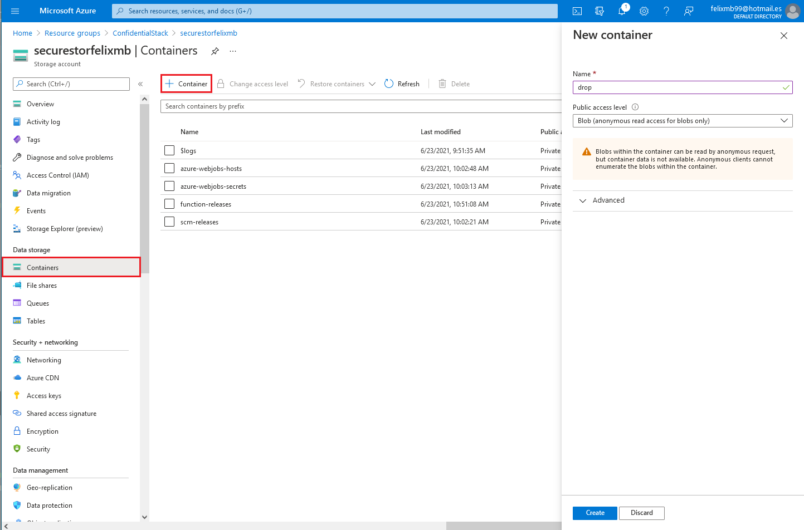

7. Return to the **Containers** section, and then select the newly created **drop** container.

8. From the **Container** blade, select **Upload**.

9. In the

    

   Upload blob

    

   pop-up window, perform the following actions:

   1. In the **Files** section, select the **Folder** icon.
   2. In the **File Explorer** window, browse to **Allfiles (F):\Allfiles\Labs\07\Starter**, select the **records.json** file, and then select **Open**.
   3. Ensure that **Overwrite if files already exist** is selected, and then select **Upload**.

   > **Note**: Wait for the blob to upload before you continue with this lab.

   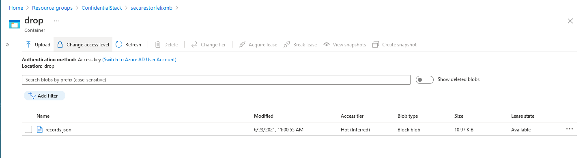

10. Return to the **Container** blade, and then select the **records.json** blob in the list of blobs.

11. From the **Blob** blade, find the blob metadata, and then copy the URL for the blob.

    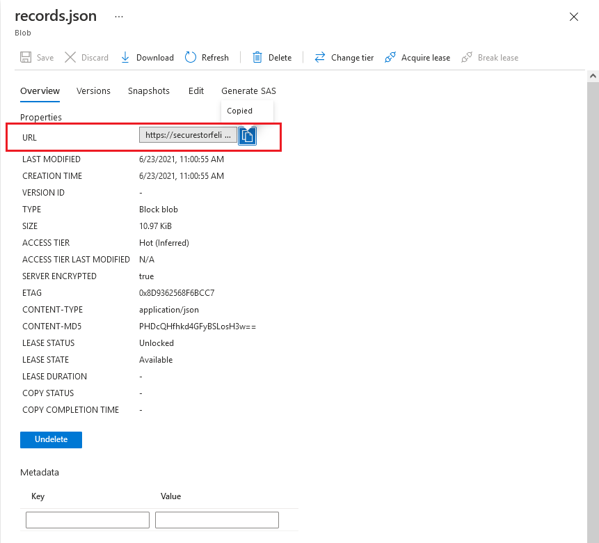

12. On the taskbar, right-click the **Microsoft Edge** icon or activate the shortcut menu, and then select **New window**.

13. In the new browser window, go to the URL that you copied for the blob.

14. The JavaScript Object Notation (JSON) contents of the blob should now display. Close the browser window with the JSON contents.

    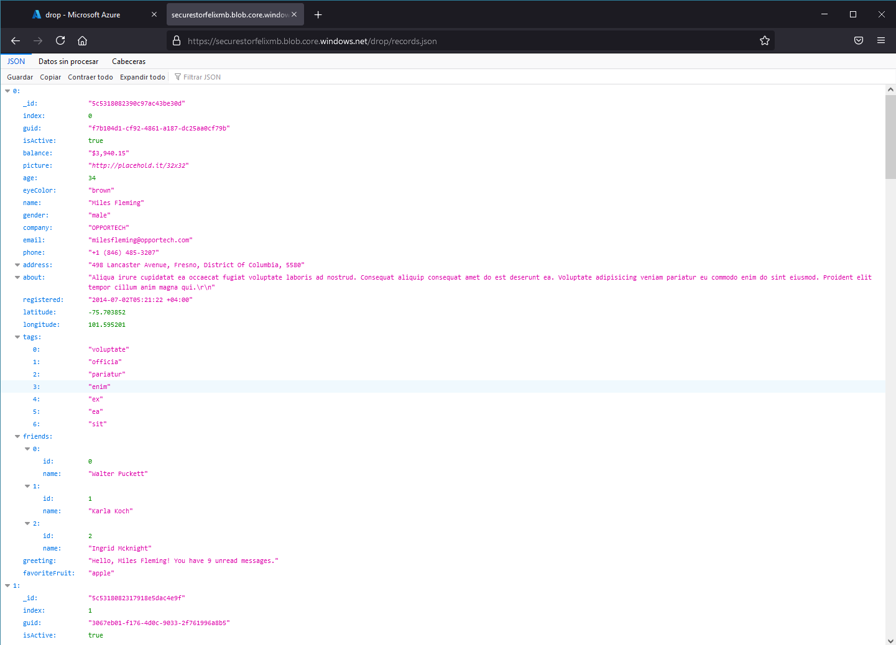

15. Return to the browser window with the Azure portal, and then close the **Blob** blade.

16. Return to the **Container** blade, and then select **Change access level**.

17. In the

     

    Change access level

     

    pop-up window, perform the following actions:

    1. In the **Public access level** drop-down list, select **Private (no anonymous access)**.

    2. Select **OK**.

       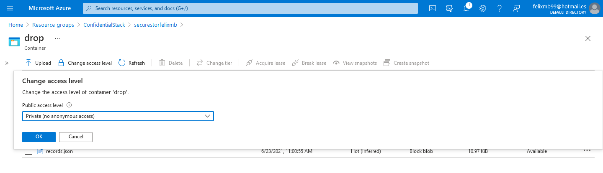

18. On the taskbar, right-click the **Microsoft Edge** icon or activate the shortcut menu, and then select **New window**.

19. In the new browser window, go to the URL that you copied for the blob.

20. An error message indicating that the resource wasn't found should now display.

    > **Note**: If the error message doesn't display, your browser might have cached the file. Press Ctrl+F5 to refresh the page until the error message displays.

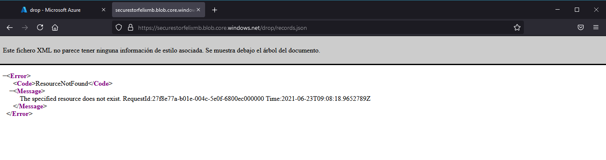

#### Task 2: Pull and configure the Azure SDK for .NET

1. On the taskbar, select the **Windows Terminal** icon.

2. Enter the following command, and then select Enter to change the current directory to the **Allfiles (F):\Allfiles\Labs\07\Starter\func** empty directory:

   ```
   cd F:\Allfiles\Labs\07\Starter\func
   ```

3. At the open command prompt, enter the following command, and then select Enter to add version **12.6.0** of the **Azure.Storage.Blobs** package from NuGet:

   ```
   dotnet add package Azure.Storage.Blobs --version 12.6.0
   ```

   > **Note**: The [Azure.Storage.Blobs](https://www.nuget.org/packages/Azure.Storage.Blobs/12.6.0) NuGet package references the subset of the Azure SDK for .NET required to write code for Azure Blob Storage.

   

4. Close the currently running **Windows Terminal** application.

5. On the **Start** screen, select the **Visual Studio Code** tile.

6. From the **File** menu, select **Open Folder**.

7. In the **File Explorer** window that opens, browse to **Allfiles (F):\Allfiles\Labs\07\Starter\func**, and then select **Select Folder**.

8. In the Explorer pane of the **Visual Studio Code** window, open the **FileParser.cs** file.

9. Add a **using directive** for the **Azure.Storage.Blobs** namespace:

   ```
   using Azure.Storage.Blobs;
   ```

10. Observe the **FileParser.cs** file, which should now include:

    ```
    using Azure.Storage.Blobs;
    using Microsoft.AspNetCore.Mvc;
    using Microsoft.Azure.WebJobs;
    using Microsoft.AspNetCore.Http;
    using System;
    using System.Threading.Tasks;
    
    public static class FileParser
    {
        [FunctionName("FileParser")]
        public static async Task<IActionResult> Run(
            [HttpTrigger("GET")] HttpRequest request)
        {
            string connectionString = Environment.GetEnvironmentVariable("StorageConnectionString");
            return new OkObjectResult(connectionString);
        }
    }
    ```

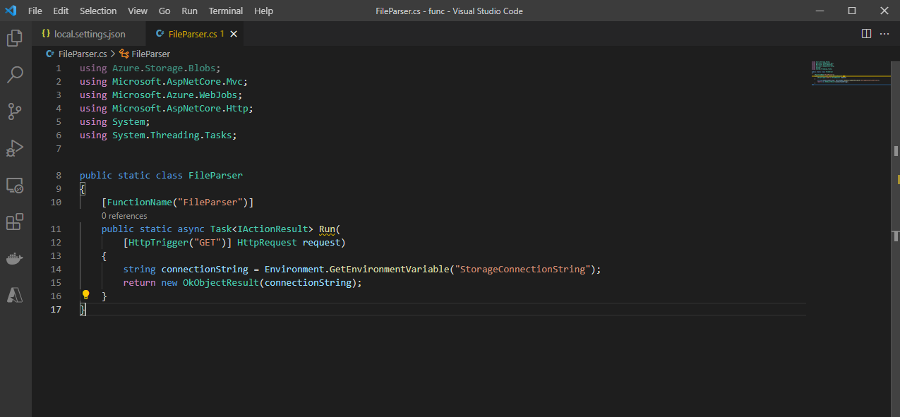

#### Task 3: Write Azure Blob Storage code using the Azure SDK for .NET

1. Within the **Run** method of the **FileParser** class, delete the following line of code:

   ```
   return new OkObjectResult(connectionString);
   ```

2. Still within the **Run** method, add the following code block to create a new instance of the **BlobClient** class by passing in your *connectionString* variable, a `"drop"` string value, and a `"records.json"` string value to the constructor:

   ```
   BlobClient blob = new BlobClient(connectionString, "drop", "records.json");
   ```

3. Still within the **Run** method, add the following code block to use the **BlobClient.DownloadAsync** method to download the contents of the referenced blob asynchronously and store the result in a variable named *response*:

   ```
   var response = await blob.DownloadAsync();
   ```

4. Still within the **Run** method, add the following code block to return the value of the various content stored in the *content* variable by using the **FileStreamResult** class constructor:

   ```
   return new FileStreamResult(response?.Value?.Content, response?.Value?.ContentType);
   ```

5. Observe the **FileParser.cs** file again, which should now include:

   ```
   using Azure.Storage.Blobs;
   using Microsoft.AspNetCore.Mvc;
   using Microsoft.Azure.WebJobs;
   using Microsoft.AspNetCore.Http;
   using System;
   using System.Threading.Tasks;
   
   public static class FileParser
   {
       [FunctionName("FileParser")]
       public static async Task<IActionResult> Run(
           [HttpTrigger("GET")] HttpRequest request)
       {
           string connectionString = Environment.GetEnvironmentVariable("StorageConnectionString");
           BlobClient blob = new BlobClient(connectionString, "drop", "records.json");
           var response = await blob.DownloadAsync();
           return new FileStreamResult(response?.Value?.Content, response?.Value?.ContentType);
       }
   }
   ```

6. Select **Save** to save your changes to the **FileParser.cs** file.

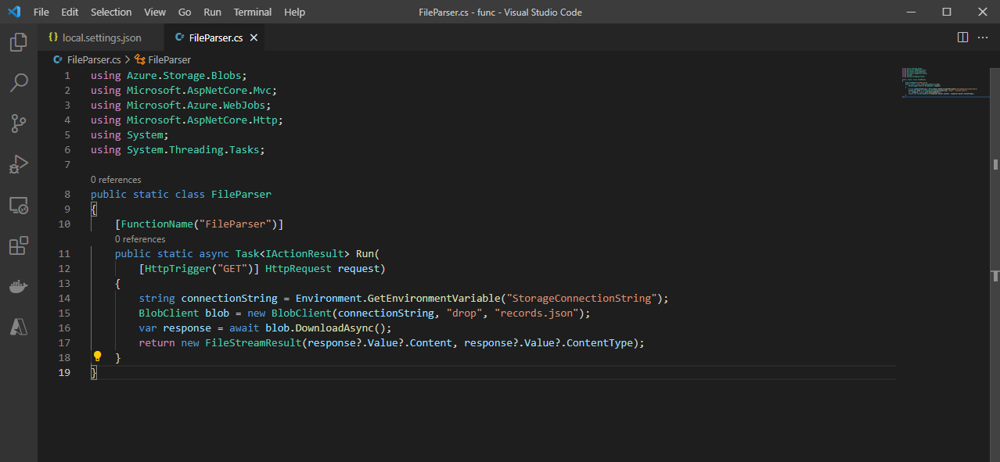

#### Task 4: Deploy and validate the Azure Functions app

1. On the taskbar, select the **Windows Terminal** icon.

2. Enter the following command, and then select Enter to change the current directory to the **Allfiles (F):\Allfiles\Labs\07\Starter\func** empty directory:

   ```
   cd F:\Allfiles\Labs\07\Starter\func
   ```

3. At the open command prompt, enter the following command, and then select Enter to log in to the Azure CLI:

   ```
   az login
   ```

4. In the **Microsoft Edge** browser window, perform the following actions:

   1. Enter the email address for your Microsoft account, and then select **Next**.
   2. Enter the password for your Microsoft account, and then select **Sign in**.

5. Return to the currently open **Windows Terminal** window. Wait for the sign-in process to finish.

6. Enter the following command, and then select Enter to publish the function app project again:

   ```
   func azure functionapp publish <function-app-name>
   ```

   > **Note**: As an example, if your **Function App name** is **securefuncstudent**, your command would be `func azure functionapp publish securefuncstudent`. You can review the documentation to [publish the local function app project][azure-functions-core-tools-publish-azure] using the **Azure Functions Core Tools**.

7. Wait for the deployment to finalize before you move forward with the lab.

8. Close the currently running **Windows Terminal** application.

   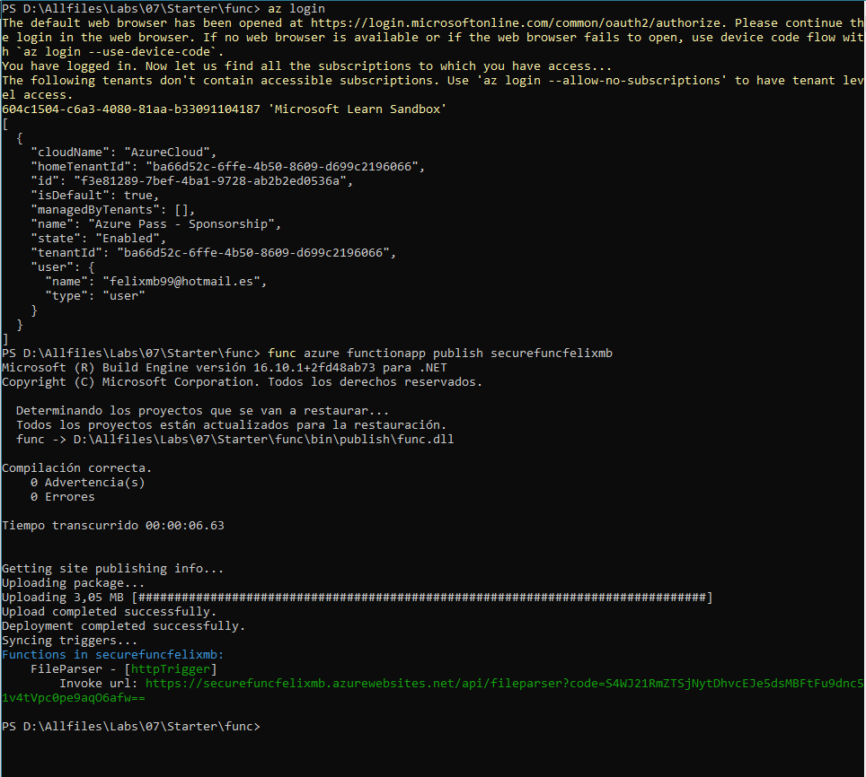

9. On the taskbar, select the **Microsoft Edge** icon.

10. In the open browser window, go to the Azure portal ([https://portal.azure.com](https://portal.azure.com/)).

11. In the Azure portal's navigation pane, select the **Resource groups** link.

12. On the **Resource groups** blade, find and then select the **ConfidentialStack** resource group that you created earlier in this lab.

13. On the **ConfidentialStack** blade, select the **securefunc[yourname]** function app that you created earlier in this lab.

14. From the **App Service** blade, select the **Functions** option from the **Functions** section.

15. In the **Functions** pane, select the the existing **FileParser** function.

16. In the **Function** blade, select the **Code + Test** option from the **Developer** section.

17. In the function editor, select **Test/Run**.

18. In the pop-up dialog box that appears, perform the following actions:

    - In the **HTTP method** list, select **GET**.

19. Select **Run** to test the function.

20. Observe the results of the test run. The output will contain the content of the **$/drop/records.json** blob stored in your Azure Storage account.

> **Review**: In this exercise, you used C# code to access a storage account, and then downloaded the contents of a blob.

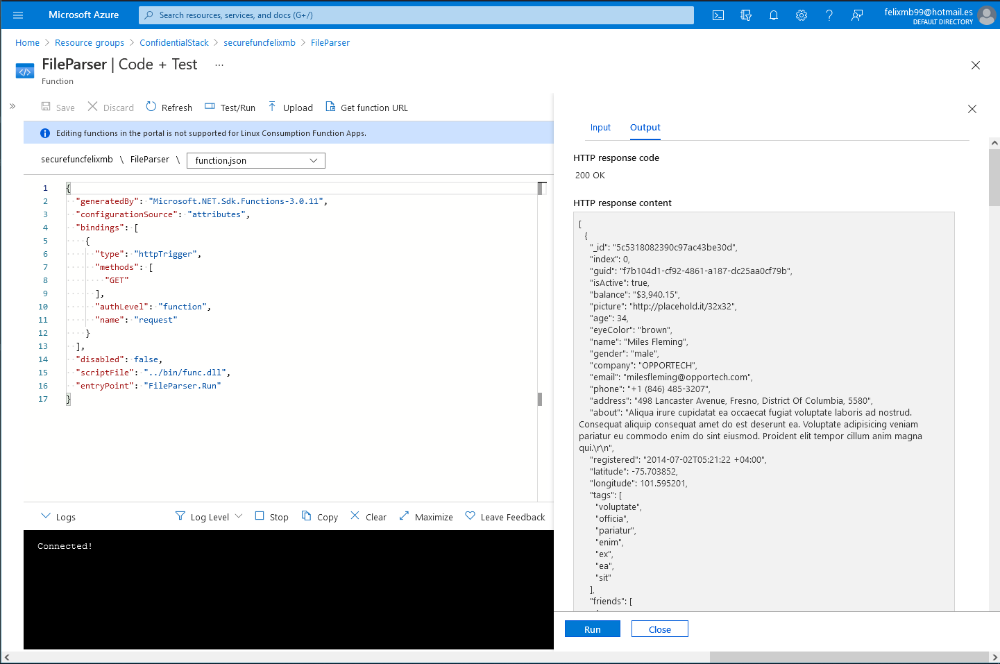

### Exercise 5: Clean up your subscription

#### Task 1: Open Azure Cloud Shell and list resource groups

1. In the Azure portal's navigation pane, select the **Cloud Shell** icon to open a new shell instance.

   > **Note**: The **Cloud Shell** icon is represented by a greater than sign (>) and underscore character (_).

2. If this is your first time opening Cloud Shell using your subscription, you can use the **Welcome to Azure Cloud Shell Wizard** to configure Cloud Shell for first-time usage. Perform the following actions in the wizard:

   1. A dialog box prompts you to configure the shell. Select **Bash**, review the selected subscription, and then select **Create storage**.

   > **Note**: Wait for Cloud Shell to finish its initial setup procedures before moving forward with the lab. If Cloud Shell configuration options don't display, this is most likely because you are using an existing subscription with this course's labs. The labs are written with the presumption that you are using a new subscription.

#### Task 2: Delete a resource group

1. When you receive the command prompt, enter the following command, and then select Enter to delete the **ConfidentialStack** resource group:

   ```
   az group delete --name ConfidentialStack --no-wait --yes
   ```

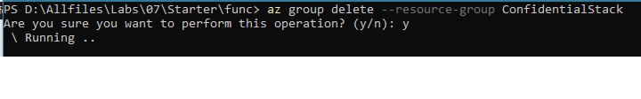