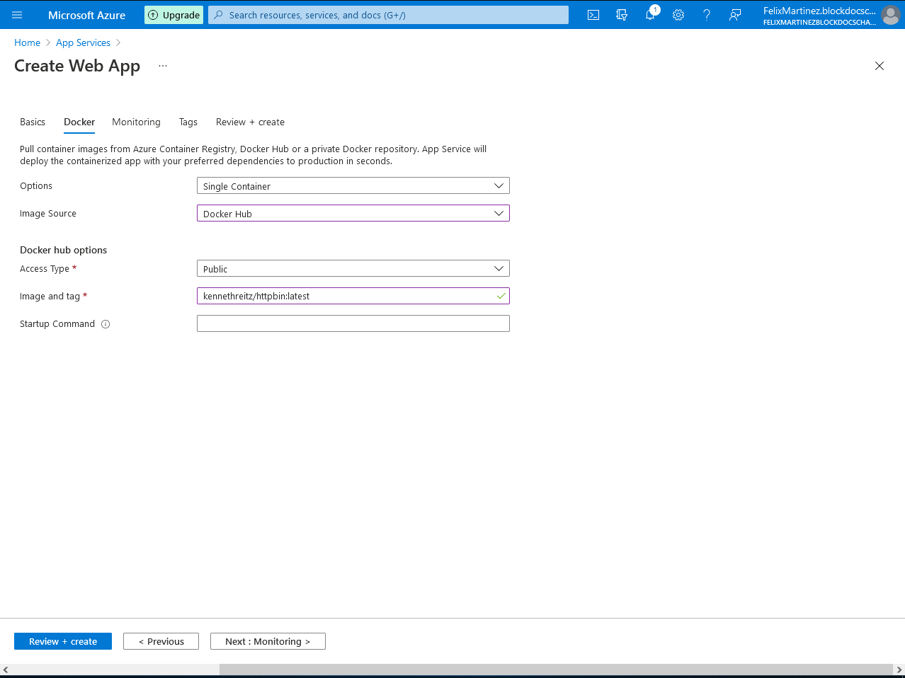

# Lab 08: Creating a multi-tier solution by using services in Azure

## Microsoft Azure user interface

Given the dynamic nature of Microsoft cloud tools, you might experience Azure UI changes after the development of this training content. These changes might cause the lab instructions and steps to not match up.

Microsoft updates this training course when the community brings needed changes to our attention. However, because cloud updates occur frequently, you might encounter UI changes before this training content updates. **If this occurs, adapt to the changes, and then work through them in the labs as needed.**

## Instructions

### Before you start

#### Sign in to the lab virtual machine

Sign in to your Windows 10 virtual machine (VM) by using the following credentials:

- Username: **Admin**
- Password: **Pa55w.rd**

> **Note**: Instructions to connect to the virtual lab environment will be provided by your instructor.

#### Review the installed applications

Find the taskbar on your Windows 10 desktop. The taskbar contains the icons for the applications that you’ll use in this lab:

- Microsoft Edge

### Exercise 1: Creating an Azure App Service resource by using a Docker container image

#### Task 1: Open the Azure portal

1. On the taskbar, select the **Microsoft Edge** icon.

2. In the open browser window, go to the Azure portal ([https://portal.azure.com](https://portal.azure.com/)).

3. At the sign-in page, enter the email address for your Microsoft account, and then select **Next**.

4. Enter the password for your Microsoft account, and then select **Sign in**.

   > **Note**: If this is your first time signing in to the Azure portal, you will be offered a tour of the portal. Select **Get Started** to skip the tour and begin using the portal.

#### Task 2: Create a web app by using Azure App Service resource by using an httpbin container image

1. In the Azure portal’s navigation pane, select **Create a resource**.

2. From the **Create a resource** blade, find the **Search services and marketplace** text box.

3. In the search box, enter **Web App**, and then select Enter.

4. From the **Marketplace** search results blade, select the **Web App** result.

5. From the **Web App** blade, select **Create**.

6. From the **Create Web App** blade, find the tabs from the blade, such as **Basics**.

   > **Note**: Each tab represents a step in the workflow to create a new web app. You can select **Review + Create** at any time to skip the remaining tabs.

7. From the **Basics** tab, perform the following actions:

   1. Leave the **Subscription** text box set to its default value.
   2. In the **Resource group** section, select **Create new**, enter **ApiService**, and then select **OK**.
   3. In the **Name** text box, enter **httpapi\*[yourname]\***.
   4. In the **Publish** section, select **Docker Container**.
   5. In the **Operating System** section, select **Linux**.
   6. In the **Region** drop-down list, select the **East US** region.
   7. In the **Linux Plan (East US)** section, select **Create new**, enter the value **ApiPlan** in the **Name** text box, and then select **OK**.
   8. Leave the **SKU and size** section set to its default value.
   9. Select **Next: Docker**.

8. From the **Docker** tab, perform the following actions:

   1. In the **Options** drop-down list, select **Single Container**.
   2. In the **Image Source** drop-down list, select **Docker Hub**.
   3. In the **Access Type** drop-down list, select **Public**.
   4. In the **Image and tag** text box, enter **kennethreitz/httpbin:latest**.
   5. Select **Review + Create**.

9. From the **Review + Create** tab, review the options that you selected during the previous steps.

10. Select **Create** to create the web app by using your specified configuration.

    > **Note**: Wait for the creation task to complete before you move forward with this lab.




#### Task 3: Test the httpbin web application

1. In the Azure portal’s navigation pane, select **Resource groups**.

2. From the **Resource groups** blade, select the **ApiService** resource group that you created earlier in this lab.

3. From the **ApiService** blade, select the **httpapi\*[yourname]\*** web app that you created earlier in this lab.

4. From the **App Services** blade, select **Browse**.

   

   

5. Within the web application, perform the following actions:

   1. Select **Response formats**.
   2. Select **GET /xml**.
   3. Select **Try it out**.
   4. Select **Execute**.
   5. Observe the value of the **Response body** and **Response headers** text boxes.
   6. Observe the value of the **Request URL** text box.

   


6. Close the browser window for the web application.

7. Find the **App Services** blade for the **httpapi\*[yourname]\*** web app back in the Azure portal

8. From the **App Services** blade, in the **Settings** section, select the **Properties** link.

9. In the **Properties** section, record the value of the **URL** text box. You’ll use this value later in the lab to make requests against the API.

   

### Exercise 2: Build an API proxy tier by using Azure API Management

#### Task 1: Create an API Management resource

1. In the Azure portal’s navigation pane, select **Create a resource**.

2. From the **Create a resource** blade, find the **Search services and marketplace** text box.

3. In the search box, enter **API**, and then select Enter.

4. From the **Marketplace** search results blade, select the **API Management** result.

5. From the **API Management** blade, select **Create**.

6. From the **API Management Service** blade, perform the following actions:

   1. In the **Resource name** text box, enter **prodapi\*[yourname]\***.

   2. Leave the **Subscription** text box set to its default value.

   3. In the **Resource group** list, select the **ApiService** group that you created earlier in the lab.

   4. In the **Location** list, select **East US**.

   5. In the **Organization name** text box, enter **Contoso**.

   6. Leave the **Administrator email** text box set to its default value.

      > **Note**: If this field is empty, you can enter any non-working email address.

   7. In the **Pricing tier** list, select **Consumption (99.9 SLA, %)**.

   8. Select **Create**.

   > **Note**: Wait for the creation task to complete before you move forward with this lab.


#### Task 2: Define a new API

1. In the Azure portal’s navigation pane, select **Resource groups**.

2. From the **Resource groups** blade, select the **ApiService** resource group that you created earlier in this lab.

3. From the **ApiService** blade, select the **prodapi\*[yourname]\*** API Management account that you created earlier in this lab.

4. From the **API Management Service** blade, in the **API Management** section, select **APIs** .

5. In the **Add a new API** section, select **Blank API**.

   

6. In the **Create a blank API** window, perform the following actions:

   1. In the **Display name** text box, enter **HTTPBin API**.

   2. In the **Name** text box, enter **httpbin-api**.

   3. In the **Web service URL** text box, enter the URL for the web app that you copied earlier in this lab.

      > **Note**: Depending on how you copy the URL, you might need to add an “http://” prefix to create a valid URL value.

   4. Leave the **API URL suffix** text box empty.

   5. Select **Create**.

   > **Note**: Wait for the new API to finish being created.

   

7. From the **Design** tab, select **Add operation**.

8. In the **Add operation** section, perform the following actions:

   1. In the **Display name** text box, enter **Echo Headers**.

   2. In the **Name** text box, enter **echo-headers**.

   3. In the **URL** list, select **GET**.

   4. In the **URL** text box, enter **/**.

   5. Select **Save**.

      

9. Back from the **Design** tab, in the list of operations, select **All Operations**.

10. In the **Design** section for **All Operations**, find the **Inbound processing** tile, and then select **Add policy**.

11. In the **Add inbound policy** section, select the **Set headers** tile.

12. In the **Inbound processing, Set Headers** section, perform the following actions:

    1. In the **Name** text box, enter **source**.

    2. In the **Value** text box, select the list, select **Add Value**, and then enter **azure-api-mgmt**.

    3. In the **Action** list, select **append**.

    4. Select **Save**.

       

13. Back from the **Design** tab, in the list of operations, select **Echo Headers**.

14. In the **Design** section for **Echo Headers**, find the **Backend** tile, and then select the pencil icon.

15. In the **Backend** section, perform the following actions:

    1. In the **Service URL** section, select the **Override** check box.

    2. In the **Service URL** text box, append the value **/headers** to its current value.

       > **Note**: For example, if the current value is **http://httpapi\*[yourname]\*.azurewebsites.net**, the new value will be **http://httpapi\*[yourname]\*.azurewebsites.net/headers**

    3. Select **Save**.

       

16. Back from the **Design** tab, in the list of operations, select **Echo Headers**.

17. From the **Test** tab, select the **Echo Headers** operation.

18. In the **Echo Headers** section, select **Send**.

19. Observe the results of the API request.

    > **Note**: Observe how there’s many headers sent as part of your request that are echoed in the response. Specifically, you’ll notice the new **Source** header that you created as part of this task.

20. Select the **Design** tab to return to the list of operations.

    

#### Task 3: Manipulate an API response

1. From the **Design** tab, select **Add operation**.

2. In the **Add operation** section, perform the following actions:

   1. In the **Display name** text box, enter **Get Legacy Data**.

   2. In the **Name** text box, enter **get-legacy-data**.

   3. In the **URL** list, select **GET**.

   4. In the **URL** text box, enter **/xml**.

   5. Select **Save**.

      

3. Back from the **Design** tab, in the list of operations, select **Get Legacy Data**.

4. From the **Test** tab, select the **Get Legacy Data** operation.

5. In the **Get Legacy Data** section, select **Send**.

6. Observe the results of the API request.

   > **Note**: At this point, the results should be in XML format.

   

7. Back from the **Design** tab, in the list of operations, select **Get Legacy Data**.

8. In the **Design** section for the **Get Legacy Data** operation, find the **Outbound processing** tile, and then select **Add policy**.

9. In the **Add outbound policy** section, select the **Other policies** tile.

10. In the policy code editor, find the following block of XML content:

    CodeCopy

    ```
    <outbound>
        <base />
    </outbound>
    ```

11. Replace that block of XML with the following XML:

    CodeCopy

    ```
    <outbound>
        <base />
        <xml-to-json kind="direct" apply="always" consider-accept-header="false" />
    </outbound>
    ```

12. In the policy code editor, select **Save**.

    

13. Back from the **Design** tab, in the list of operations, select **Get Legacy Data**.

14. From the **Test** tab, select the **Get Legacy Data** operation.

15. In the **Get Legacy Data** section, select **Send**.

16. Observe the results of the API request.

    > **Note**: The new results are in JavaScript Object Notation (JSON) format.

    

#### Review

In this exercise, you built a proxy tier between your App Service resource and any developers who wish to make queries.

### Exercise 3: Clean up your subscription

#### Task 1: Open Azure Cloud Shell

1. In the Azure portal’s navigation pane, select the **Cloud Shell** icon to open a new shell instance.

   > **Note**: The **Cloud Shell** icon is represented by a greater than sign (>) and underscore character (_).

2. If this is your first time opening Cloud Shell using your subscription, you can use the **Welcome to Azure Cloud Shell Wizard** to configure Cloud Shell for first-time usage. Perform the following actions in the wizard:

   - A dialog box prompts you to configure the shell. Select **Bash**, review the selected subscription, and then select **Create storage**.

   > **Note**: Wait for Cloud Shell to finish its initial setup procedures before moving forward with the lab. If you don’t notice Cloud Shell configuration options, this is most likely because you’re using an existing subscription with this course’s labs. The labs are written with the presumption that you’re using a new subscription.

#### Task 2: Delete resource groups

1. Enter the following command, and then select Enter to delete the **ApiService** resource group:

   

#### Review

In this exercise, you cleaned up your subscription by removing the resource groups used in this lab.