### Demo: Use .NET Core to send and receive messages from a Service Bus queue

In this demo you will learn how to:

- Create a Service Bus namespace, and queue, using the Azure CLI.
- Create a .NET Core console application to send a set of messages to the queue.
- Create a .NET Core console application to receive those messages from the queue.

#### Prerequisites

This demo is performed in the Cloud Shell, and in Visual Studio Code. The code examples below rely on the **Microsoft.Azure.ServiceBus** NuGet package.

##### Login to Azure

1. Login in to the Azure Portal: [https://portal.azure.com](https://portal.azure.com/) and launch the Cloud Shell. Be sure to select **Bash** as the shell.

2. Create a resource group, replace <myRegion> with a location that makes sense for you. Copy the first line by itself and edit the value.

   `myLocation=<myRegion> myResourceGroup="az204-svcbusdemo-rg" az group create -n $myResourceGroup -l $myLocation`

   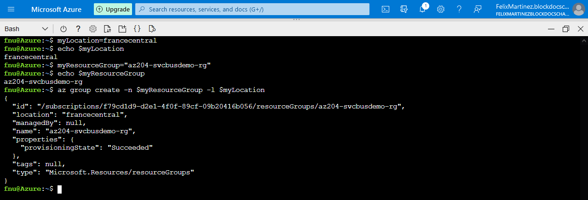

#### Create the Service Bus namespace and queue

1. Create a Service Bus messaging namespace with a unique name, the script below will generate a unique name for you. It will take a few minutes for the command to finish.

   `namespaceName=az204svcbus$RANDOM az servicebus namespace create \ --resource-group $myResourceGroup \ --name $namespaceName \ --location $myLocation`

2. Create a Service Bus queue

   `az servicebus queue create --resource-group $myResourceGroup \ --namespace-name $namespaceName \ --name az204-queue`

   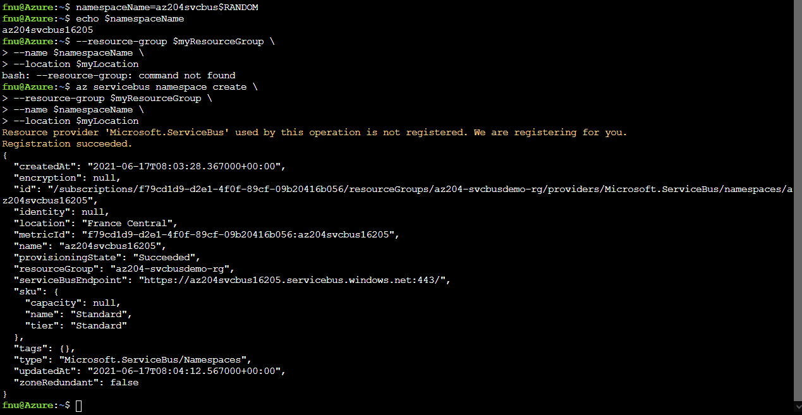

3. Get the connection string for the namespace

   `connectionString=$(az servicebus namespace authorization-rule keys list \ --resource-group $myResourceGroup \ --namespace-name $namespaceName \ --name RootManageSharedAccessKey \ --query primaryConnectionString --output tsv) echo $connectionString`

   

After the last command runs, copy and paste the connection string to a temporary location such as Notepad. You will need it in the next step.

#### Create console app to send messages to the queue

1. Set up the new console app on your local machine

   - Create a new folder named *az204svcbusSend*.

   - Open a terminal in the new folder and run dotnet new console

   - Run the dotnet add package Microsoft.Azure.ServiceBus command to ensure you have the packages you need.

   - Launch Visual Studio Code and open the new folder.

     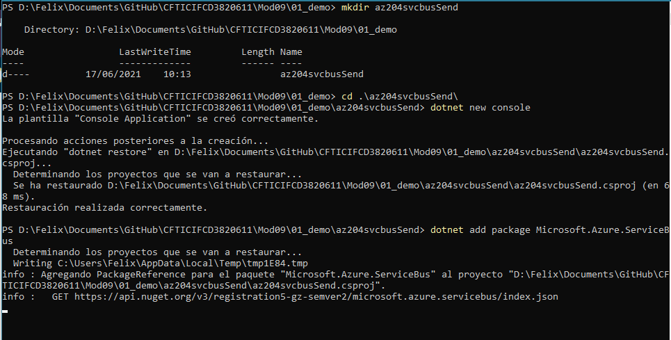

2. In *Program.cs*, add the following using statements at the top of the namespace definition, before the class declaration:

   `using System.Text; using System.Threading; using System.Threading.Tasks; using Microsoft.Azure.ServiceBus;`

3. Within the Program class, declare the following variables. Set the ServiceBusConnectionString variable to the connection string that you obtained when creating the namespace:

   `const string ServiceBusConnectionString = "<your_connection_string>"; const string QueueName = "az204-queue"; static IQueueClient queueClient;`

4. Replace the default contents of Main() with the following line of code:

   `public static async Task Main(string[] args) {    const int numberOfMessages = 10;    queueClient = new QueueClient(ServiceBusConnectionString, QueueName);     Console.WriteLine("======================================================");    Console.WriteLine("Press ENTER key to exit after sending all the messages.");    Console.WriteLine("======================================================");     // Send messages.    await SendMessagesAsync(numberOfMessages);     Console.ReadKey();     await queueClient.CloseAsync(); }`

5. Directly after Main(), add the following asynchronous MainAsync() method that calls the send messages method:

   `static async Task MainAsync() {    const int numberOfMessages = 10;    queueClient = new QueueClient(ServiceBusConnectionString, QueueName);     Console.WriteLine("======================================================");    Console.WriteLine("Press ENTER key to exit after sending all the messages.");    Console.WriteLine("======================================================");     // Send messages.    await SendMessagesAsync(numberOfMessages);     Console.ReadKey();     await queueClient.CloseAsync(); }`

6. Directly after the MainAsync() method, add the following SendMessagesAsync() method that performs the work of sending the number of messages specified by numberOfMessagesToSend (currently set to 10):

   `static async Task SendMessagesAsync(int numberOfMessagesToSend) {    try    {        for (var i = 0; i < numberOfMessagesToSend; i++)        {            // Create a new message to send to the queue.            string messageBody = $"Message {i}";            var message = new Message(Encoding.UTF8.GetBytes(messageBody));             // Write the body of the message to the console.            Console.WriteLine($"Sending message: {messageBody}");             // Send the message to the queue.            await queueClient.SendAsync(message);        }    }    catch (Exception exception)    {        Console.WriteLine($"{DateTime.Now} :: Exception: {exception.Message}");    } }`

   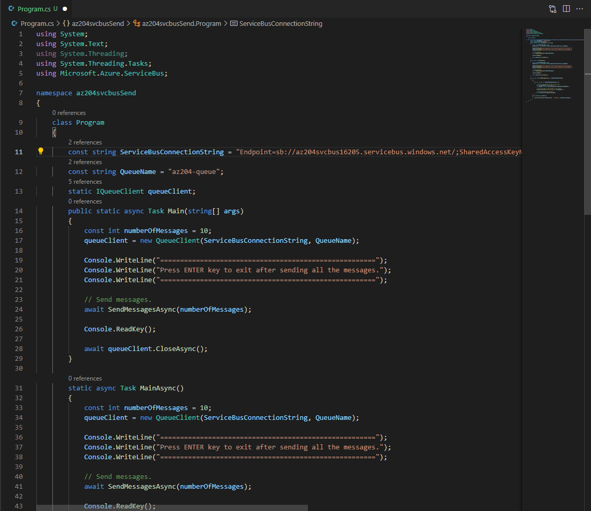

   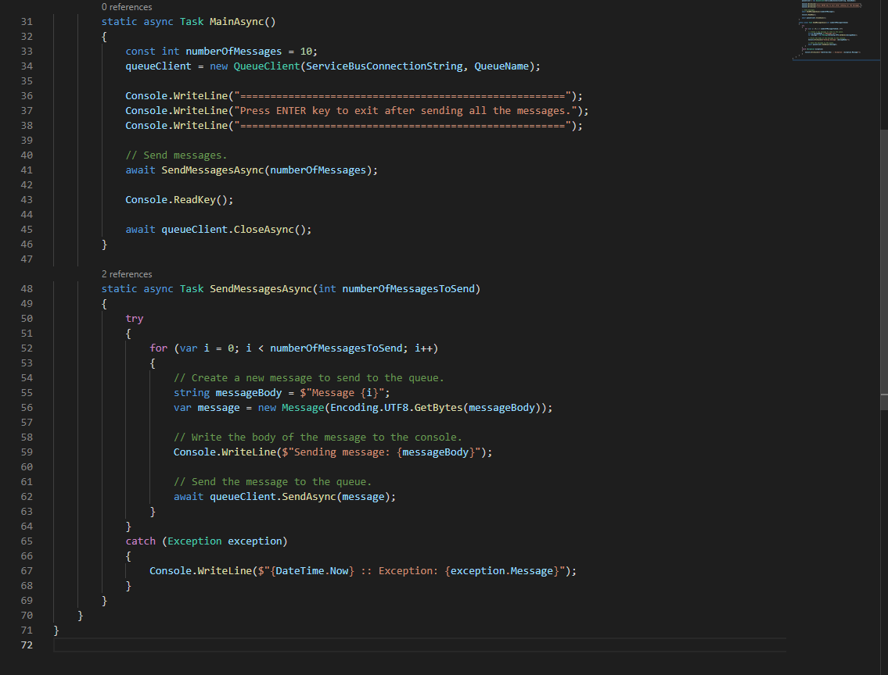

7. Save the file and run the following commands in the terminal.

   `dotnet build dotnet run`

   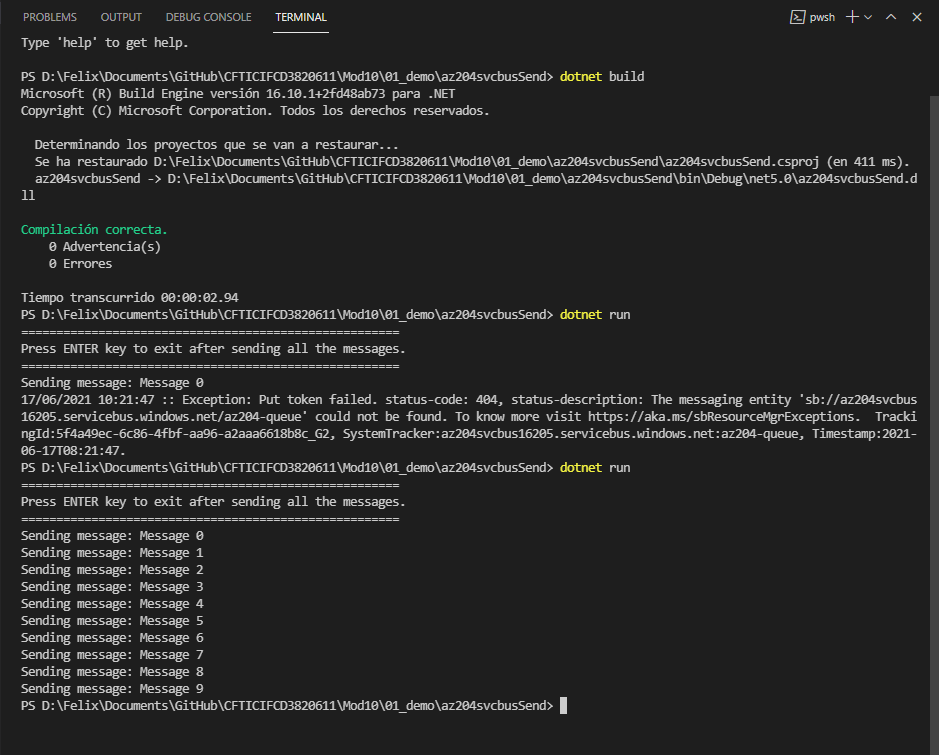

8. Login to the Azure Portal and navigate to the *az204-queue* you created earlier and select **Overview** to show the Essentials screen.

   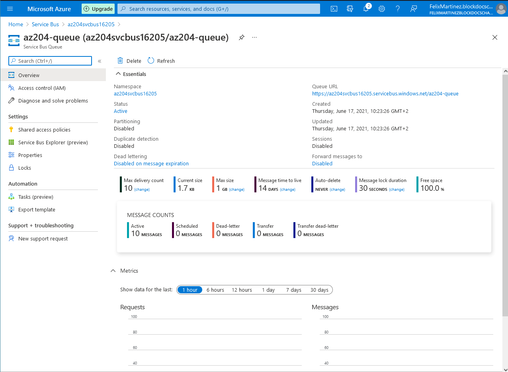

Notice that the Active Message Count value for the queue is now 10. Each time you run the sender application without retrieving the messages (as described in the next section), this value increases by 10.

#### Step 3: Write code to receive messages to the queue

1. Set up the new console app

   - Create a new folder named *az204svcbusRec*.

   - Open a terminal in the new folder and run dotnet new console

   - Run the dotnet add package Microsoft.Azure.ServiceBus command to ensure you have the packages you need.

   - Launch Visual Studio Code and open the new folder.

     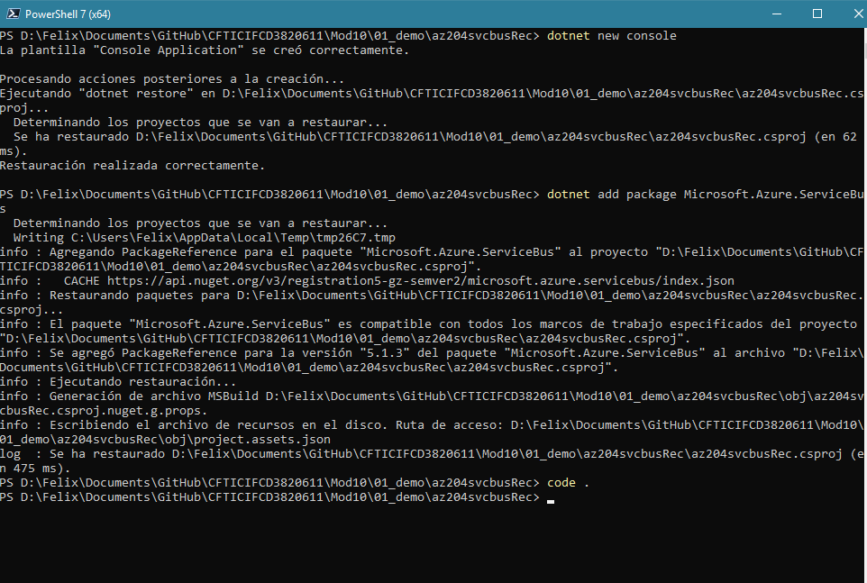

     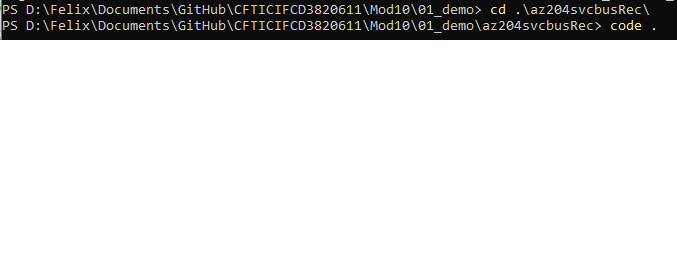

2. In *Program.cs*, add the following using statements at the top of the namespace definition, before the class declaration:

   `using System.Text; using System.Threading; using System.Threading.Tasks; using Microsoft.Azure.ServiceBus;`

3. Within the Program class, declare the following variables. Set the ServiceBusConnectionString variable to the connection string that you obtained when creating the namespace:

   `const string ServiceBusConnectionString = "<your_connection_string>"; const string QueueName = "az204-queue"; static IQueueClient queueClient;`

4. Replace the Main() method with the following:

   `public static async Task Main(string[] args) {    queueClient = new QueueClient(ServiceBusConnectionString, QueueName);     Console.WriteLine("======================================================");    Console.WriteLine("Press ENTER key to exit after receiving all the messages.");    Console.WriteLine("======================================================");     // Register the queue message handler and receive messages in a loop    RegisterOnMessageHandlerAndReceiveMessages();     Console.ReadKey();     await queueClient.CloseAsync(); }`

5. Directly after Main(), add the following asynchronous MainAsync() method that calls the RegisterOnMessageHandlerAndReceiveMessages() method:

   `static async Task MainAsync() {    queueClient = new QueueClient(ServiceBusConnectionString, QueueName);     Console.WriteLine("======================================================");    Console.WriteLine("Press ENTER key to exit after receiving all the messages.");    Console.WriteLine("======================================================");     // Register the queue message handler and receive messages in a loop    RegisterOnMessageHandlerAndReceiveMessages();     Console.ReadKey();     await queueClient.CloseAsync(); }`

6. Directly after the MainAsync() method, add the following method that registers the message handler and receives the messages sent by the sender application:

   `static void RegisterOnMessageHandlerAndReceiveMessages() {    // Configure the message handler options in terms of exception handling, number of concurrent messages to deliver, etc.    var messageHandlerOptions = new MessageHandlerOptions(ExceptionReceivedHandler)    {        // Maximum number of concurrent calls to the callback ProcessMessagesAsync(), set to 1 for simplicity.        // Set it according to how many messages the application wants to process in parallel.        MaxConcurrentCalls = 1,         // Indicates whether the message pump should automatically complete the messages after returning from user callback.        // False below indicates the complete operation is handled by the user callback as in ProcessMessagesAsync().        AutoComplete = false    };     // Register the function that processes messages.    queueClient.RegisterMessageHandler(ProcessMessagesAsync, messageHandlerOptions); }`

7. Directly after the previous method, add the following ProcessMessagesAsync() method to process the received messages:

   `static async Task ProcessMessagesAsync(Message message, CancellationToken token) {    // Process the message.    Console.WriteLine($"Received message: SequenceNumber:{message.SystemProperties.SequenceNumber} Body:{Encoding.UTF8.GetString(message.Body)}");     // Complete the message so that it is not received again.    // This can be done only if the queue Client is created in ReceiveMode.PeekLock mode (which is the default).    await queueClient.CompleteAsync(message.SystemProperties.LockToken);     // Note: Use the cancellationToken passed as necessary to determine if the queueClient has already been closed.    // If queueClient has already been closed, you can choose to not call CompleteAsync() or AbandonAsync() etc.    // to avoid unnecessary exceptions. }`

8. Finally, add the following method to handle any exceptions that might occur:

   `// Use this handler to examine the exceptions received on the message pump. static Task ExceptionReceivedHandler(ExceptionReceivedEventArgs exceptionReceivedEventArgs) {    Console.WriteLine($"Message handler encountered an exception {exceptionReceivedEventArgs.Exception}.");    var context = exceptionReceivedEventArgs.ExceptionReceivedContext;    Console.WriteLine("Exception context for troubleshooting:");    Console.WriteLine($"- Endpoint: {context.Endpoint}");    Console.WriteLine($"- Entity Path: {context.EntityPath}");    Console.WriteLine($"- Executing Action: {context.Action}");    return Task.CompletedTask; }`

   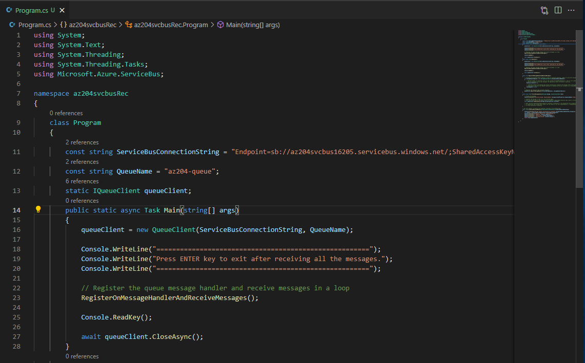

   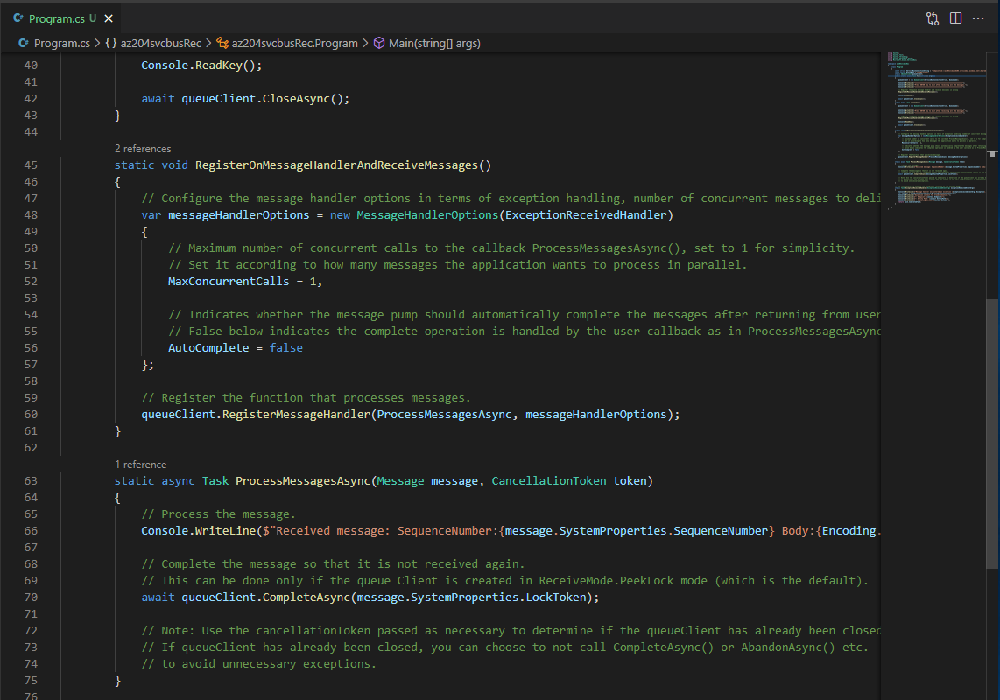

   

9. Save the file and run the following commands in the terminal.

   - dotnet build

   - dotnet run

     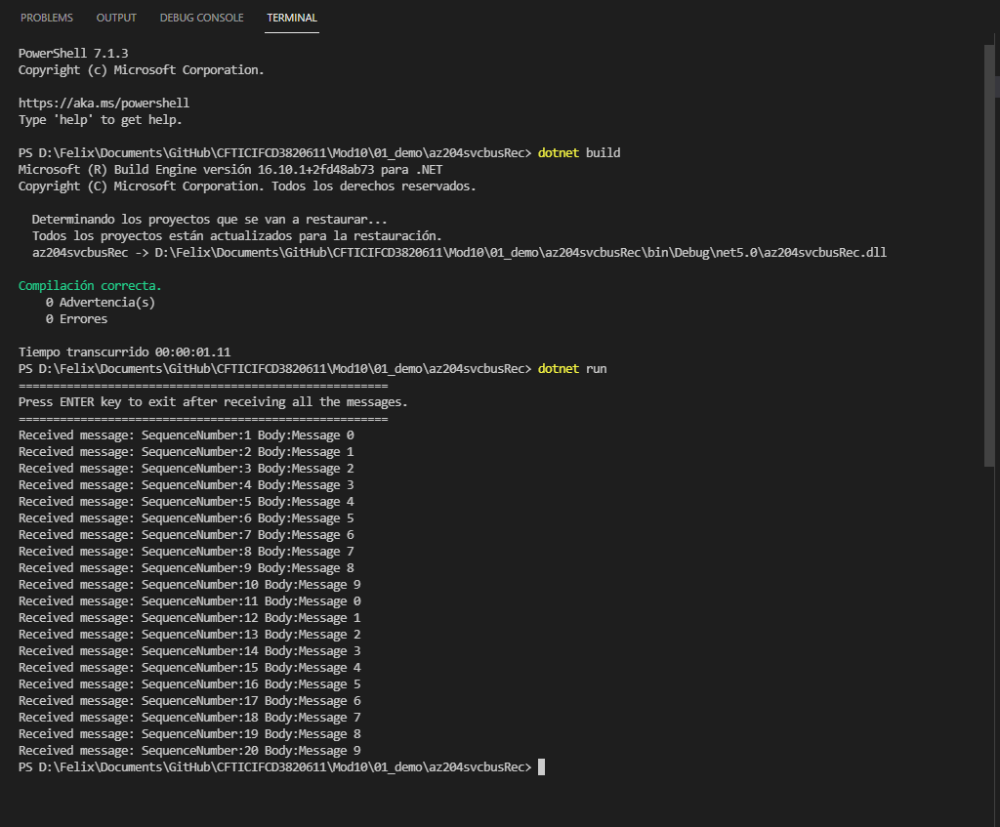

10. Check the portal again. Notice that the **Active Message Count** value is now 0. You may need to refresh the portal page.

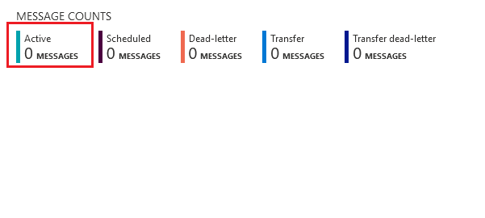