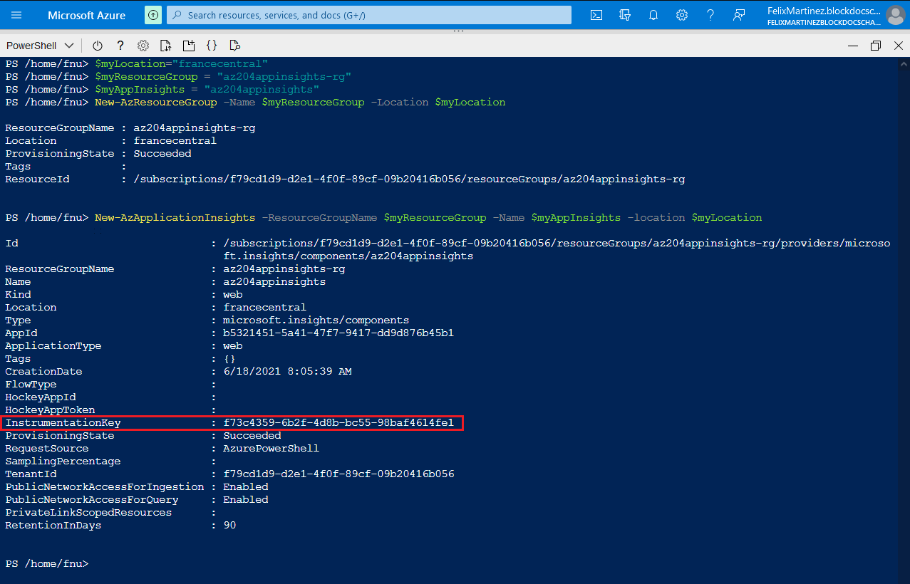
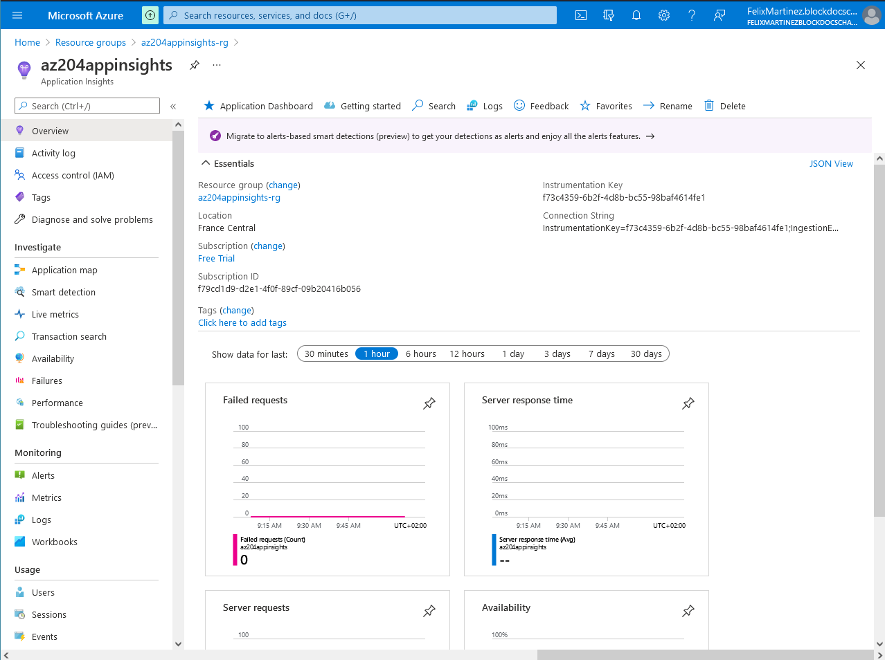
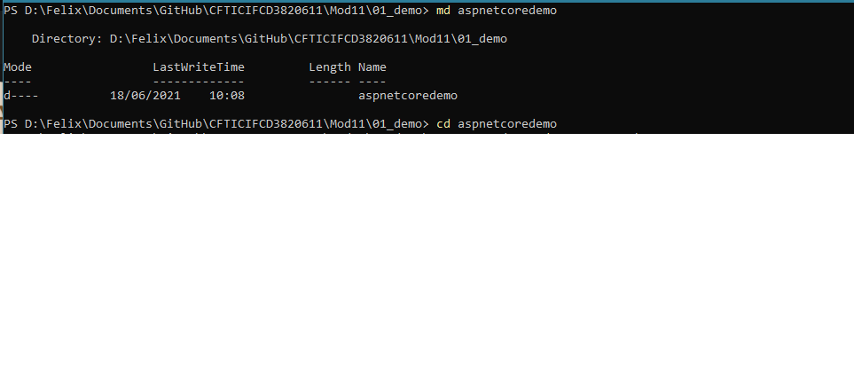
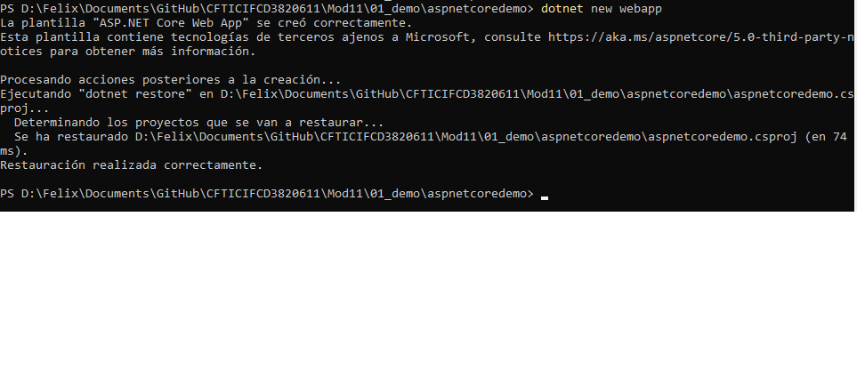
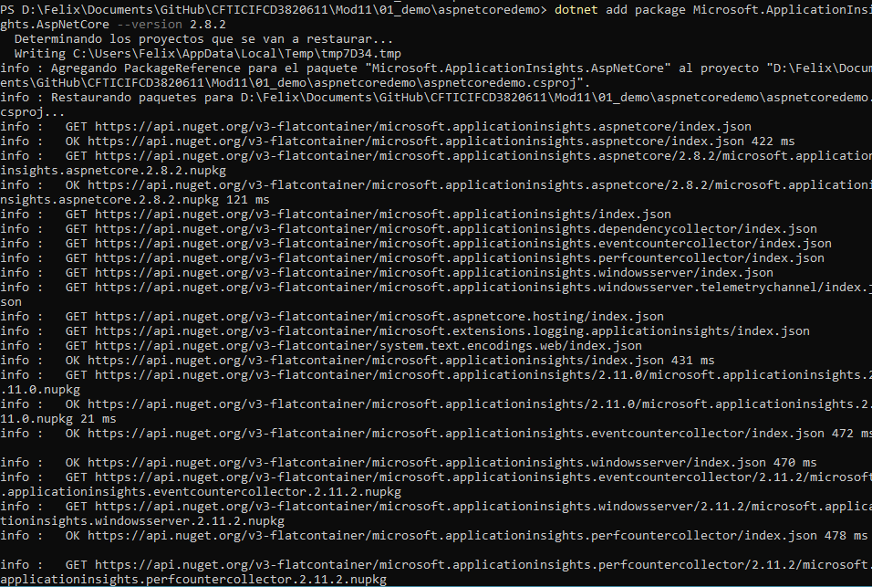
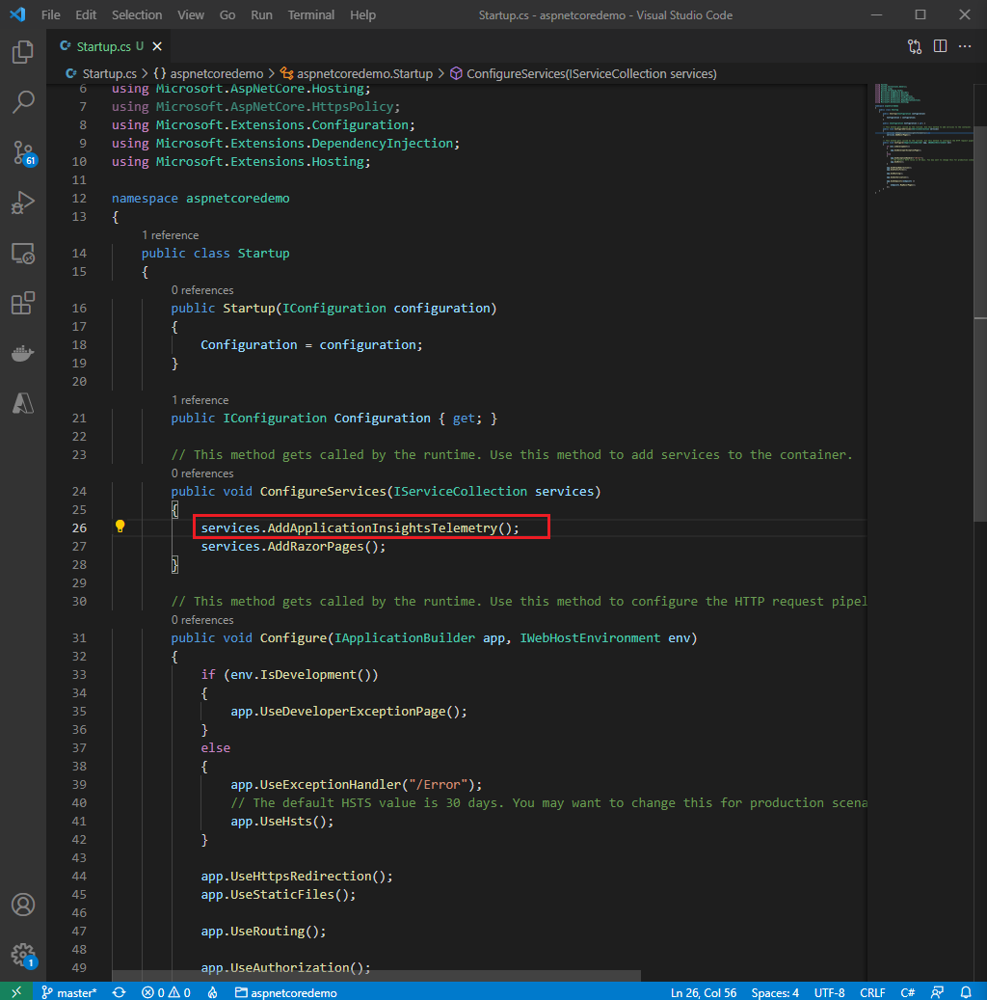
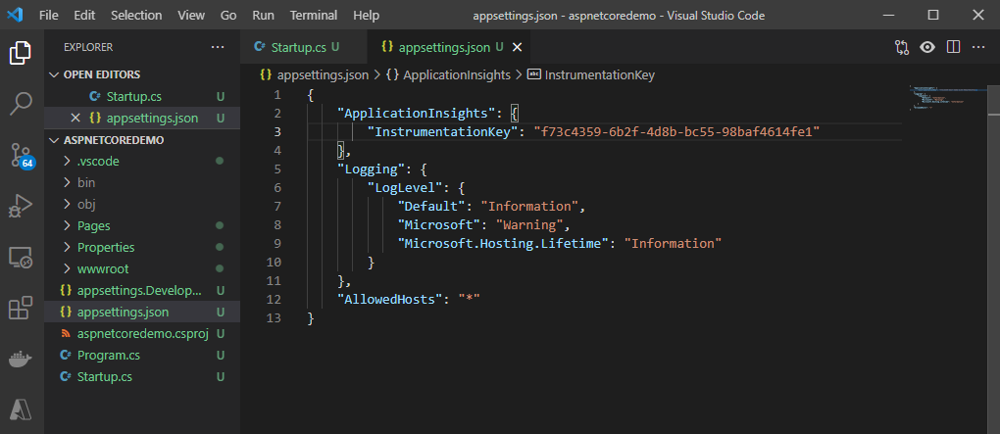
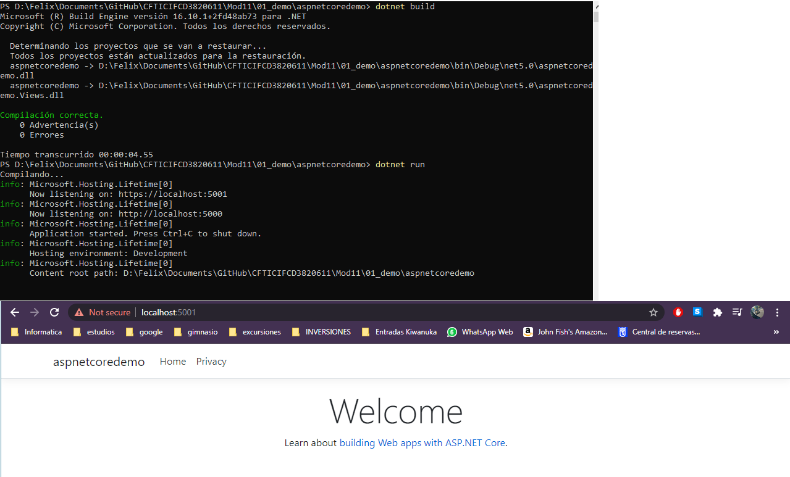
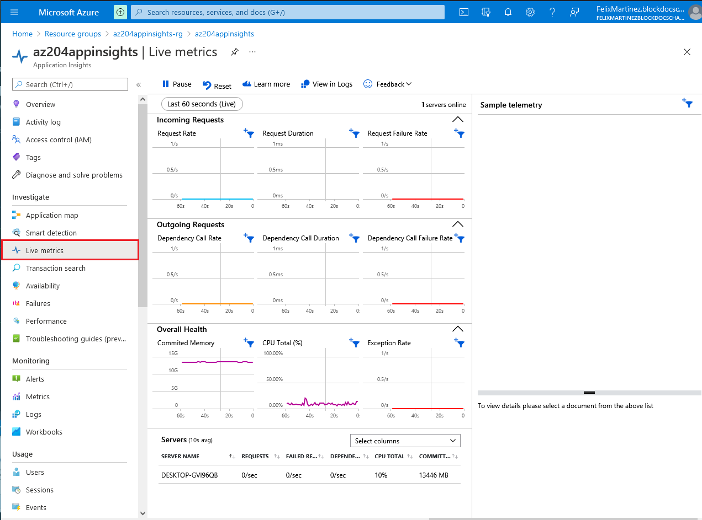

### Demo: Instrument an ASP.NET Core app for monitoring in Application Insights

In this demo you will learn how to:

- Instrument a ASP.NET Core app to send server-side telemetry
- Instrument a ASP.NET Core app to send client-side telemetry

#### Prerequisites

This demo is performed in the Cloud Shell, and in Visual Studio Code. The code examples below rely on the **Microsoft.ApplicationInsights.AspNetCore** NuGet package.

##### Login to Azure

1. Login in to the Azure Portal: [https://portal.azure.com](https://portal.azure.com/) and launch the Cloud Shell. Be sure to select **PowerShell** as the shell.

2. Create a resource group and Application Insights instance with a location that makes sense for you.

   `$myLocation = Read-Host -Prompt "Enter the region (i.e. westus): " $myResourceGroup = "az204appinsights-rg" $myAppInsights = "az204appinsights" # Create the resource group New-AzResourceGroup -Name $myResourceGroup -Location $myLocation # Create App Insights instance New-AzApplicationInsights -ResourceGroupName $myResourceGroup -Name $myAppInsights -location $myLocation`

3. Save the InstrumentationKey value to Notepad for use later.

   

4. Navigate to the new Application Insights resource and select **Live Metrics Stream**. We'll be going back to this page to view the metrics being sent later.

   

#### Create an ASP.NET Core app

1. In a terminal or command window create a new folder for the project, and change in to the new folder.

   `md aspnetcoredemo cd aspnetcoredemo`

   

2. Create a new ASP.Net Core web app.

   `dotnet new webapp`

   

3. Launch Visual Studio Code in the context of the new folder.

   `code . --new-window`

   

4. Install the Application Insights SDK NuGet package for ASP.NET Core by running the following command in a VS Code terminal.

   `dotnet add package Microsoft.ApplicationInsights.AspNetCore --version 2.8.2`

   

   The following lines should appear in the projects .csproj file.
   
   <ItemGroup>    <PackageReference Include="Microsoft.ApplicationInsights.AspNetCore" Version="2.8.2" /> </ItemGroup>

#### Enable server-side telemetry in the app

1. Add services.AddApplicationInsightsTelemetry(); to the ConfigureServices() method in your Startup class, as in this example:

   `// This method gets called by the runtime. Use this method to add services to the container.    public void ConfigureServices(IServiceCollection services)    {        // The following line enables Application Insights telemetry collection.        services.AddApplicationInsightsTelemetry();         // This code adds other services for your application.        services.AddRazorPages();    }`

   

2. Set up the instrumentation key.

   The following code sample shows how to specify an instrumentation key in appsettings.json. Update the code with the key you saved earlier.

   `{    "ApplicationInsights": {        "InstrumentationKey": "putinstrumentationkeyhere"    },    "Logging": {        "LogLevel": {        "Default": "Warning"        }    }    }`

   

3. Build and run the app by using the following commands.

   `dotnet build dotnet run`

4. Open a new browser window and navigate to http://localhost:5000 to view your web app.

   

5. Set the browser window for the app side-by-side with the portal showing the Live Metrics Stream. Notice the incoming requests on the Live Metrics Stream as you navigate around the web app.

   

6. In Visual Studio Code type ctrl-c to close the application.

#### Enable client-side telemetry in the app

✔️ **Note:** The following steps illustrate how to enable client-side telemetry in the app. Because there is no client-side activity in the default app it won't impact the information being sent to Application Insights in this demo.

1. Add the following injection in the _ViewImports.cshtml file:

   @inject Microsoft.ApplicationInsights.AspNetCore.JavaScriptSnippet JavaScriptSnippet

   

2. Insert the HtmlHelper in the _Layout.cshtml file at the end of the <head> section but before any other script. If you want to report any custom JavaScript telemetry from the page, inject it after this snippet:

   @Html.Raw(JavaScriptSnippet.FullScript)    </head>

   The .cshtml file names referenced earlier are from a default MVC application template. Ultimately, if you want to properly enable client-side monitoring for your application, the JavaScript snippet must appear in the <head> section of each page of your application that you want to monitor. You can accomplish this goal for this application template by adding the JavaScript snippet to _Layout.cshtml.
   
   
   
   
